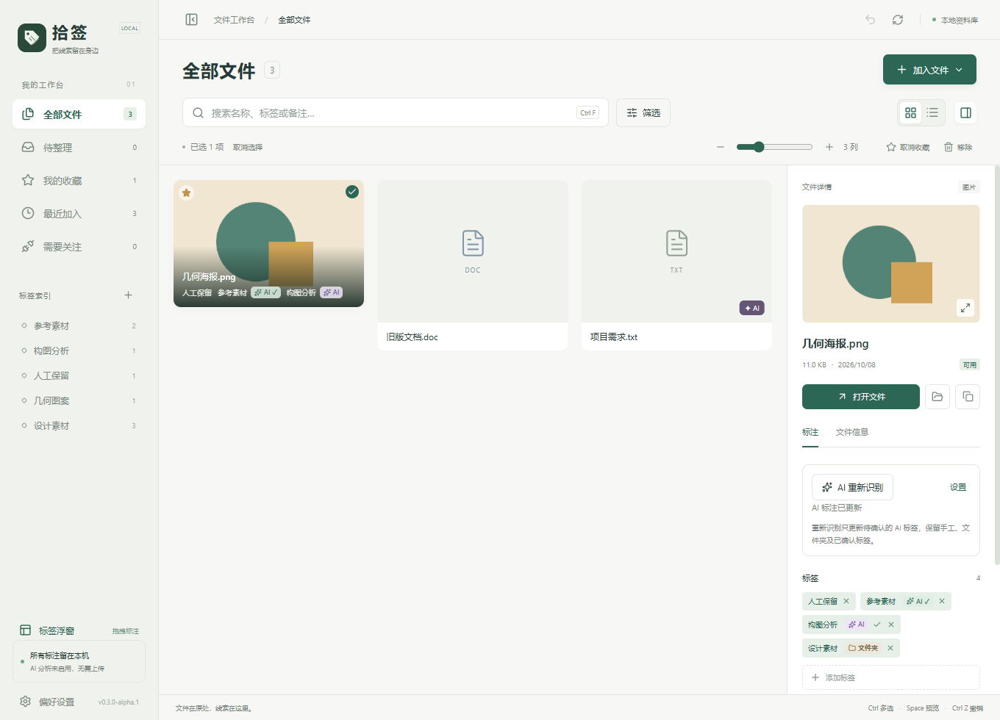
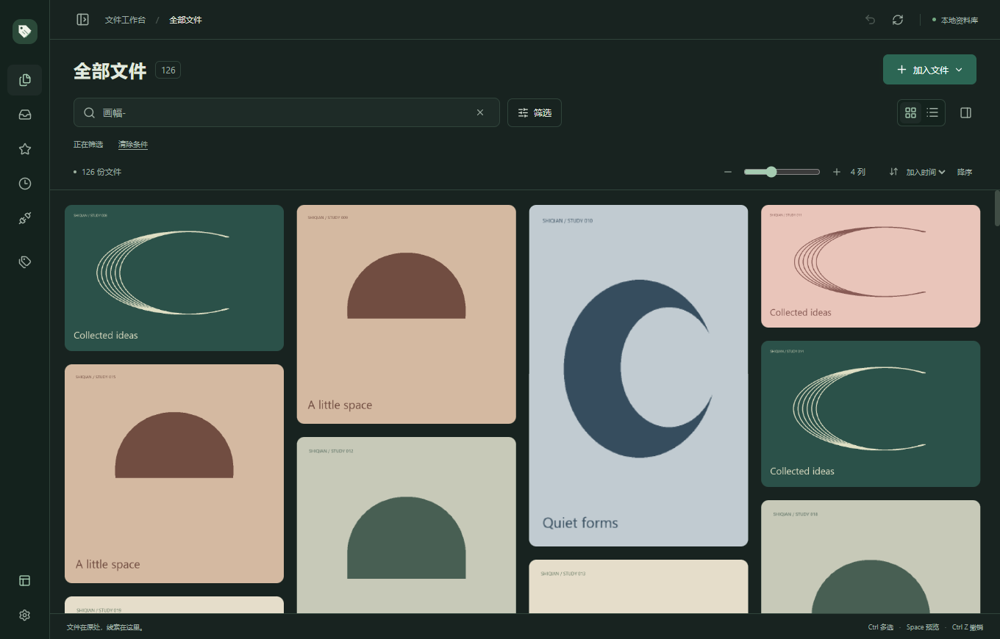
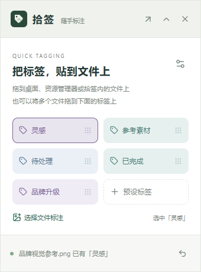
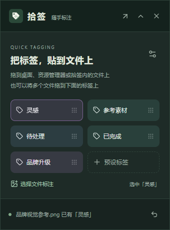

<div align="center">
  
  <h1>拾签 · Shiqian</h1>
  <p><strong>顺手贴上标签，随时找回灵感。</strong></p>
  <p>一个围绕本地文件、多标签与轻量浮窗设计的 Windows 资料整理工具。</p>
  <p>
    
    
    
    
  </p>
  <p>
    <a href="docs/auto-tags-v0.3.md">自动标签体验版说明</a> ·
    <a href="https://github.com/SACO1F/Shiqian/releases/tag/v0.2.2">历史版本下载</a> ·
    <a href="docs/desktop-guide.md">使用与开发指南</a> ·
    <a href="docs/roadmap.md">开发路线</a> ·
    <a href="docs/agent-integration.md">Agent 结合分析</a>
  </p>
</div>

---

> **当前为 0.3.0-alpha.1 自动标签体验版。** 导入文件自动添加文件夹标签；配置 AI 后可识别图片/文档，优先匹配已有标签，并记录 AI 来源与人工确认状态。本地 Windows 安装包位于 `releases/v0.3.0-alpha.1/`。完整后端测试、桌面导入与识别流程、界面和瀑布流回归已通过；真实模型的准确率仍取决于用户所选服务。见 [使用与开发说明](docs/auto-tags-v0.3.md) 与 [验证记录](docs/validation-auto-tags-v0.3.md)。历史 v0.2.2 下载不包含本次功能。

## 把标签，贴到文件上

文件可以留在原来的文件夹。给它添加「灵感」「参考素材」「待处理」，再用标签、备注和组合筛选找回。一个文件可以拥有多个标签，无需为了分类反复复制文件。

标签浮窗保持置顶，让整理动作留在手边：将标签拖向具体文件，或把一批文件拖到标签上。

**v0.2.2 修复瀑布流图片重叠**：切换列数和调整窗口后按实际卡片高度重新布局；「＋」增加列数，「－」减少列数。支持 2～8 列、悬停名称与可收拢侧栏。[使用说明](docs/gallery-v0.2.2.md)



<details>
<summary>查看深色模式与标签浮窗</summary>



<table>
  <tr><th>浅色模式</th><th>深色模式</th></tr>
  <tr>
    <td></td>
    <td></td>
  </tr>
</table>

</details>

> 标签浮窗支持 Windows 桌面、资源管理器及拾签文件卡片。完整跨窗口物理拖拽、多屏和混合 DPI 的专项验收仍待补齐；自动标签测试使用独立资料库和合成内容。[查看测试范围](docs/validation-auto-tags-v0.3.md)

## 目前能做什么

| 能力 | 说明 |
| --- | --- |
| 多标签整理 | 创建、重命名、批量添加或移除标签；支持备注与收藏 |
| 文件夹标签 | 导入时按直接父文件夹自动添加，复用同名标签，支持为已有文件补齐 |
| AI 标注 | 分析图片/文档，已有标签优先；独立 AI 标记、人工确认、批量重新识别 |
| 标签浮窗 | 4 个内置标签、自定义预设、最多固定 24 个标签；收起展开与主题切换 |
| 双向标注 | 拖标签到文件；拖多个文件到标签；也可用文件选择器完成标注 |
| 组合查找 | 搜索名称、标签和备注；组合标签、类型、目录、日期和可用性条件 |
| 本地预览 | JPEG、PNG、WebP、PDF 首页与纯文本；其他格式交给默认程序 |
| 图片瀑布流 | 图片比例排布、悬停信息、列数调节、虚拟滚动；侧栏收拢与布局偏好保存 |
| 数据保护 | 原子批次、版本冲突检查、会话内撤销、标注备份与恢复前保护备份 |

浏览器扩展、OCR、图片区域标记、语义检索和 Agent 接口目前处于规划阶段。

## 开始使用

使用本地 `releases/v0.3.0-alpha.1/` 下的 Windows x64 安装包；也可以从 [历史 Releases](https://github.com/SACO1F/Shiqian/releases/tag/v0.2.2) 获取不含自动标签功能的 v0.2.2。安装器按当前用户安装，并检查 WebView2 Runtime。运行环境就绪后，核心文件整理功能无需联网，也无需账号；可选 AI 功能需要配置模型服务。

1. 加入文件或文件夹，在工作台查看资料。
2. 从左下角打开「标签浮窗」，使用内置标签，或预设自己的标签。
3. 给文件添加标签和备注，再通过侧栏标签或搜索框找回。
4. 在「偏好设置」导出标注备份。
5. 需要自动识别时，在「偏好设置 → AI 自动标注」填写服务、视觉模型及可选密钥，保存并启用。默认不发送文件内容。

**标注是标签和文字备注，原文件内容不会被修改。** `.sqtagbackup` 包含标注、文件位置和设置，不包含原文件。单文件 EXE 仍使用系统 WebView2 与用户应用数据目录，不是把资料库存放在程序旁边的便携模式。

完整操作、快捷键、文件重新关联和恢复说明见 [桌面指南](docs/desktop-guide.md) 与 [浮窗指南](docs/floating-tags-v0.2.md)。

## 本地开发

环境：Windows x64、Node.js、Rust MSVC、Visual Studio C++ Build Tools、WebView2。已有构建记录使用 Node.js 25.8.1、Rust 1.97.1；依赖由两份锁文件固定。

```powershell
git clone https://github.com/SACO1F/Shiqian.git
cd Shiqian
npm ci
npm run desktop
```

私有仓库需要有访问权限的 GitHub 账号。已取得本地项目副本时，直接进入项目根目录执行最后两条命令即可。

```powershell
npm run build       # TypeScript 检查与前端生产构建
npm run test:core   # Rust 后端测试
npm run package     # 构建 Windows 安装包
```

安装包输出到 `src-tauri/target/release/bundle/nsis/`。PDF 资源在构建前从依赖复制，随应用发布。仅运行 `npm run dev` 不具备桌面后端能力。

## 项目结构

```text
Shiqian/
├─ src/                 React 工作台、标签浮窗与预览
├─ src-tauri/           Rust 文件操作、SQLite、备份与窗口管理
├─ scripts/             资源准备、测试与验证脚本
├─ public/              应用静态资源
├─ docs/                开发规格、指南、路线与测试证据
├─ releases/            本地历史交付文件（不进入 Git，线上见 Releases）
└─ local-only/          本地保留素材（不上传 GitHub）
```

技术栈：**Tauri 2 · React · TypeScript · Rust · SQLite**。

## 开发进展

| 阶段 | 状态 |
| --- | --- |
| 桌面文件整理与标签浮窗 v0.2.0 | 已实现，已有构建和主要流程验证 |
| 图片瀑布流、列数调节与侧栏收拢 v0.2.1 | 已实现，验证详情见本版记录 |
| 瀑布流重叠与加减号语义修复 v0.2.2 | 已实现，增加连续切换布局回归 |
| 浮窗体验、跨窗口拖拽及显示环境兼容 | 下一轮优先事项 |
| 标签治理、智能集合与目录监听 | 规划中 |
| 浏览器协同 | 已有设计文档，尚无扩展实现 |
| Agent 只读检索与整理建议 | 已完成接入分析，尚无接口实现 |

已保存的 v0.2.0 记录包含 **34 项后端测试通过**及 **42 项桌面、浮窗与目标路由检查通过**。这些是原发布环境的验证记录，不代表每次拉取都会重新运行；干净系统安装、升级、多屏和长期运行的完整验收仍待完成。

v0.2.1 另完成 **35 项后端测试**与 **50 项桌面／浮窗检查**；包含新瀑布流、缩放、侧栏、重启保存及原流程回归。[本版验证记录](docs/validation-v0.2.1.md)

v0.2.2 针对图片重叠补充 **35 个布局场景、420 帧边界检查**，并通过 **8 项图库流程检查**。旧版问题已在独立库复现，修复版覆盖连续切换列数、缓存重载、长图与窗口变化。[修复验证记录](docs/validation-v0.2.2.md)

## 文档导航

- [桌面开发规格](docs/desktop-development-spec-v0.1.md) · [浏览器扩展设计](docs/browser-extension-design-v0.2.md)
- [v0.2.1 图片瀑布流指南](docs/gallery-v0.2.1.md) · [完整桌面指南](docs/desktop-guide.md) · [标签浮窗指南](docs/floating-tags-v0.2.md)
- [v0.2.2 修复说明](docs/gallery-v0.2.2.md) · [布局回归验证](docs/validation-v0.2.2.md)
- [后续开发路线](docs/roadmap.md) · [Agent 接入分析与建议](docs/agent-integration.md)
- [v0.2 验证记录](docs/validation-v0.2.md) · [历史首版记录](docs/validation.md)
- [项目打包与仓库说明](docs/project-handoff.md) · [第三方组件声明](THIRD_PARTY_NOTICES.md)
