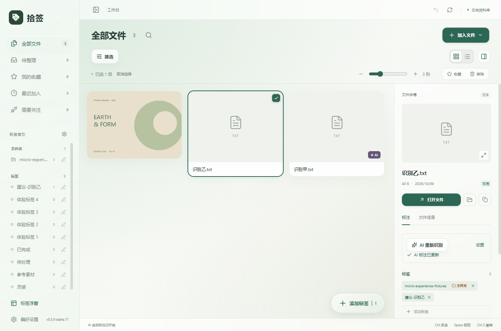
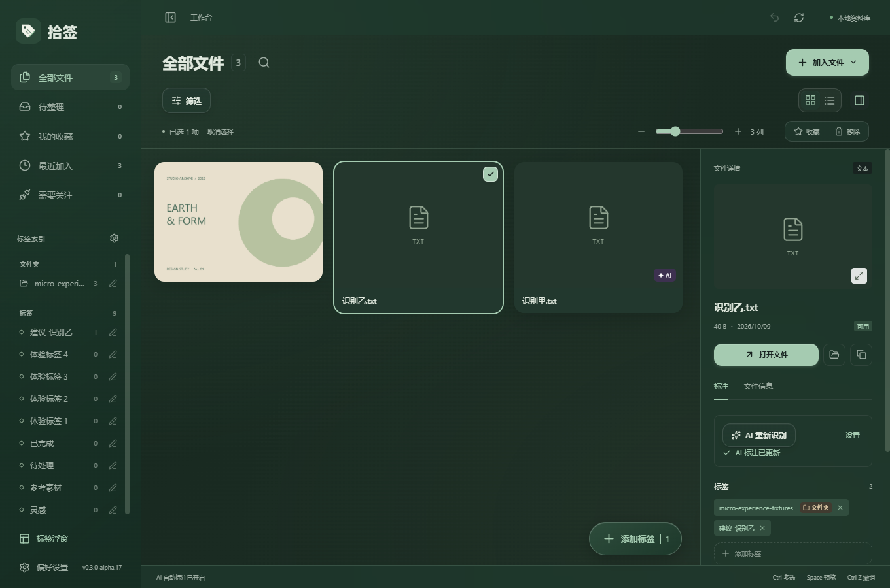
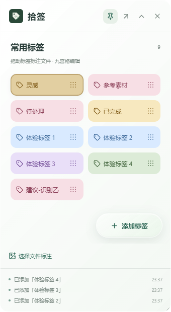
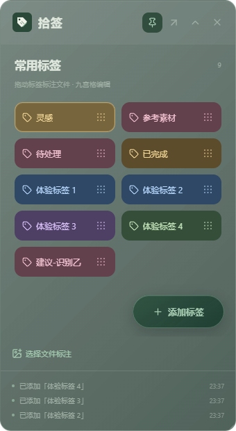
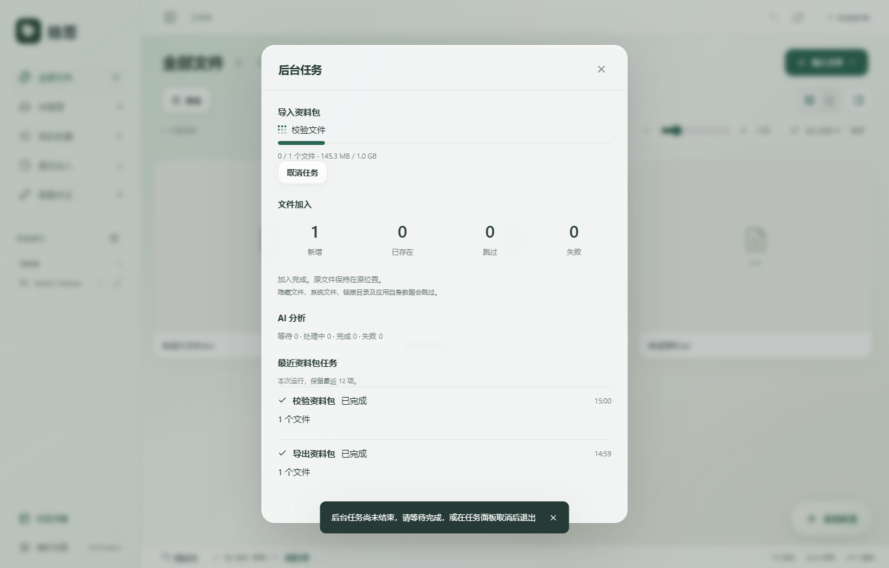

<div align="center">
  
  <h1>拾签 · Shiqian</h1>
  <p><strong>顺手贴上标签，随时找回灵感。</strong></p>
  <p>一个围绕本地文件、多标签与轻量浮窗设计的 Windows 资料整理工具。</p>
  <p>
    
    
    
    
  </p>
  <p>
    <a href="docs/beta-v0.3-beta9.md">Beta.9 体验修复指南</a> ·
    <a href="https://github.com/SACO1F/Shiqian/releases/tag/v0.3.0-beta.9"><strong>Beta.9 下载</strong></a> ·
    <a href="docs/desktop-guide.md">使用与开发指南</a> ·
    <a href="docs/roadmap.md">开发路线</a> ·
    <a href="docs/agent-integration.md">Agent 结合分析</a>
  </p>
</div>

---

> **当前版本：v0.3.0-beta.9，体验修复候选。** 将撤销、刷新和菜单切换移动到最上方自定义标题栏，移除下方多余工具栏，保留窗口控制及此前交互修复。本地交付位于 `releases/v0.3.0-beta.9/`，见 [使用说明](docs/beta-v0.3-beta9.md)、[更新记录](docs/release-notes-v0.3-beta9.md) 和 [验收范围](docs/validation-v0.3-beta9.md)。GitHub 提供 [Beta.9 预发布下载](https://github.com/SACO1F/Shiqian/releases/tag/v0.3.0-beta.9)。干净系统、覆盖安装、跨设备、多屏混合 DPI 与全天运行仍待实机验收。

## 把标签，贴到文件上

文件可以留在原来的文件夹。给它添加「灵感」「参考素材」「待处理」，再用标签、备注和组合筛选找回。一个文件可以拥有多个标签，无需为了分类反复复制文件。

标签浮窗保持置顶，让整理动作留在手边：将标签拖向具体文件，或把一批文件拖到标签上。

支持图片瀑布流、列表视图、列数调节、悬停完整标签和可调宽侧栏。界面延续 Apple 风格，保持原有绿色主题与轻量操作反馈。



<details>
<summary>查看深色模式与标签浮窗</summary>



<table>
  <tr><th>浅色模式</th><th>深色模式</th></tr>
  <tr>
    <td></td>
    <td></td>
  </tr>
</table>

</details>

> 标签浮窗支持 Windows 桌面、资源管理器及拾签文件卡片。完整跨窗口物理拖拽、多屏和混合 DPI 的专项验收仍待补齐；自动标签测试使用独立资料库和合成内容。[查看测试范围](docs/validation-auto-tags-v0.3.md)

## 目前能做什么

Beta.2 新增后台任务入口，可在资料包校验和复制期间继续搜索、浏览与编辑备注；偏好设置支持诊断报告预览及 Markdown 导出，报告不包含文件名、路径、正文或 AI 配置。



| 能力         | 说明                                                                             |
| ------------ | -------------------------------------------------------------------------------- |
| 多标签整理   | 悬浮按钮快速新建与批量标注；侧栏直接重命名，同步所有关联文件；支持备注与收藏     |
| 文件夹标签   | 导入时按直接父文件夹自动添加，侧栏独立分组，不进入浮窗；支持复用与补齐           |
| AI 标注      | 分析图片/文档，已认可标签优先；新建议确认后进入标签池，通过标签导入跳过自动识别  |
| 标签浮窗     | 半透明玻璃面板、直接添加标签、九宫格修改与删除、最多 24 个常用标签、最近三步记录 |
| 标签文件导出 | 将同一标签关联的全部文件复制到新文件夹；同名避让、失败清单、原文件保留           |
| 双向标注     | 拖标签到文件时显示目标光圈、标签名称和完成反馈；拖多个文件到标签；支持文件选择器 |
| 组合查找     | 搜索名称、标签和备注；组合标签、类型、目录、日期和可用性条件                     |
| 本地预览     | JPEG、PNG、WebP、PDF 首页与纯文本；其他格式交给默认程序                          |
| 图片瀑布流   | 图片比例排布、悬停信息、列数调节、虚拟滚动；侧栏收拢与布局偏好保存               |
| 资料包交接   | 原文件、标签来源、备注与收藏一并导出；校验预览、追加导入、取消与中断记录         |
| 数据保护     | 原子批次、版本冲突检查、会话内撤销、标注备份与恢复前保护备份                     |

浏览器扩展、OCR、图片区域标记、语义检索和 Agent 接口目前处于规划阶段。

## 开始使用

前往 [v0.3.0-beta.9 下载页](https://github.com/SACO1F/Shiqian/releases/tag/v0.3.0-beta.9)，或使用本地 `releases/v0.3.0-beta.9/` 的交付文件。

| 下载                                                                                                                                | 适合谁                                                     |
| ----------------------------------------------------------------------------------------------------------------------------------- | ---------------------------------------------------------- |
| [Windows x64 安装包](https://github.com/SACO1F/Shiqian/releases/download/v0.3.0-beta.9/Shiqian-v0.3.0-beta.9-Windows-x64-setup.exe) | 推荐给日常使用者；按当前用户安装并检查 WebView2 Runtime    |
| [单独运行的 EXE](https://github.com/SACO1F/Shiqian/releases/download/v0.3.0-beta.9/Shiqian-v0.3.0-beta.9-Windows-x64.exe)           | 系统已具备 WebView2 时可直接运行；仍使用用户应用数据目录   |
| 使用说明、验收记录、源码与 SHA256SUMS                                                                                               | 同一下载页提供；源码面向开发者，校验文件用于核对下载完整性 |

安装或升级前退出工作台和标签浮窗，升级前导出标注备份。缺少 WebView2 的电脑可能需要联网完成依赖安装。运行环境就绪后，核心文件整理功能无需联网，也无需账号；可选 AI 功能需要配置模型服务。历史版本保存在 [Releases](https://github.com/SACO1F/Shiqian/releases)。

1. 加入文件或文件夹，在工作台查看资料。
2. 从左下角打开「标签浮窗」，使用内置标签，或预设自己的标签。
3. 点击右下角「添加标签」创建标签；选中文件后可快速套用已有标签或新建并标注。侧栏标签右侧的铅笔用于重命名，关联文件会同步更新。
4. 给同事交接时，选中文件后导出资料包；同事在「偏好设置 → 资料交接」校验并导入。仅备份标注则继续使用 `.sqtagbackup`。
5. 需要自动识别时，在「偏好设置 → AI 自动标注」填写服务、视觉模型及可选密钥，保存并启用。默认不发送文件内容。

## 发给同事使用

1. 在工作台选中文件，点击「导出资料包」；或从「偏好设置 → 资料交接」选择全部文件或某个标签。
2. 将生成的 `.sqtagpack` 发给同事，并附上上方安装包下载链接。
3. 同事安装后，打开「偏好设置 → 资料交接 → 导入资料包」，校验预览并选择接收目录。
4. 确认导入后，工作台出现文件、标签、备注和收藏，已有资料保持不变。

| 导出方式         | 包含内容                                           | 使用场景                       |
| ---------------- | -------------------------------------------------- | ------------------------------ |
| 同标签文件夹导出 | 原文件副本和清单                                   | 接收者只需要文件，无需恢复标注 |
| `.sqtagbackup`   | 标注、文件位置与界面设置，不含原文件与 AI 服务配置 | 恢复标注库；恢复会替换当前库   |
| `.sqtagpack`     | 原文件、标签关系及来源、AI 确认状态、备注与收藏    | 跨路径交接，追加到接收者资料库 |

单包最多 **10,000 个文件／8 GB 原文件总量**。同名文件分别保存，同名标签复用，同包重复导入受限。导入不触发 AI 识别，也不携带 AI 服务配置和密钥。完整规则见 [交接说明](docs/beta-v0.3-beta1.md)。


**标注是标签和文字备注，原文件内容不会被修改。** `.sqtagbackup` 包含标注、文件位置和设置，不包含原文件。单文件 EXE 仍使用系统 WebView2 与用户应用数据目录，不是把资料库存放在程序旁边的便携模式。

完整操作、快捷键、文件重新关联和恢复说明见 [桌面指南](docs/desktop-guide.md) 与 [浮窗指南](docs/floating-tags-v0.2.md)。

## 最近更新

- 自定义标题栏：撤销、刷新、侧栏切换放在最上方左侧；窗口控制在右侧。
- 排序与文件操作同时常驻；全选与取消采用弹性胶囊按钮，图标操作提供悬浮提示。
- 标签在工作台创建或使用后同步到浮窗；文件夹与待确认 AI 标签保持独立规则。
- 修复详情反复展开导致滚动上移、标签候选重复／缺失及右侧拖动提示受限。
- 补齐后台任务、诊断导出、资料包取消与恢复保护，以及浮窗位置和尺寸恢复。


## 本地开发

环境：Windows x64、Node.js、Rust MSVC、Visual Studio C++ Build Tools、WebView2。已有构建记录使用 Node.js 25.8.1、Rust 1.97.1；依赖由两份锁文件固定。

```powershell
git clone https://github.com/SACO1F/Shiqian.git
cd Shiqian
npm ci
npm run desktop
```

已取得本地项目副本时，直接进入项目根目录执行最后两条命令即可。

```powershell
npm run build       # TypeScript 检查与前端生产构建
npm run test:core   # Rust 后端测试
npm run test:auto-tags # 无 WebView 核心专项
npm run package     # 构建 Windows 安装包
```

安装包输出到 `src-tauri/target/release/bundle/nsis/`。PDF 资源在构建前从依赖复制，随应用发布。仅运行 `npm run dev` 不具备桌面后端能力。

源码快照、说明与校验清单可通过 `python scripts/package-release.py` 更新。`scripts/clean-local.ps1 -DryRun` 可预览本地生成文件清理范围；清理后先执行 `npm ci`，首次 Rust 构建会重新生成缓存。

## 项目结构

```text
Shiqian/
├─ src/                 React 工作台、标签浮窗与预览
├─ src-tauri/           Rust 文件操作、SQLite、备份与窗口管理
├─ scripts/             资源准备、测试与验证脚本
├─ public/              应用静态资源
├─ docs/                开发规格、指南、路线与测试证据
├─ releases/            本地历史交付文件（不进入 Git，线上见 Releases）
└─ local-only/          本地保留素材（不上传 GitHub）
```

技术栈：**Tauri 2 · React · TypeScript · Rust · SQLite**。

## 开发进展

| 阶段                                       | 状态                                           |
| ------------------------------------------ | ---------------------------------------------- |
| 桌面文件整理与标签浮窗 v0.2.0              | 已实现，已有构建和主要流程验证                 |
| 图片瀑布流、列数调节与侧栏收拢 v0.2.1      | 已实现，验证详情见本版记录                     |
| 瀑布流重叠与加减号语义修复 v0.2.2          | 已实现，增加连续切换布局回归                   |
| Apple 风格、标签治理与操作反馈 alpha.3～17 | 已实现并完成专项回归                           |
| 资料包交接与稳定性 beta.1                  | 已实现，已验证升级、恢复、取消与独立资料库交接 |
| 干净系统、多屏与全天运行                   | Beta 后续环境验收                              |
| 标签治理、智能集合与目录监听               | 规划中                                         |
| 浏览器协同                                 | 已有设计文档，尚无扩展实现                     |
| Agent 只读检索与整理建议                   | 已完成接入分析，尚无接口实现                   |

最近一次后端核心回归在 Beta.6 完成：**94 项通过、0 失败、2 项可选压力测试忽略**。Beta.9 的生产桌面回归覆盖自定义标题栏窗口控制、常驻工具栏、全选／取消、浅深色提示、标签候选及四处选择器；详情连续开关 12 轮，滚动位置不变。见 [Beta.9 验收记录](docs/validation-v0.3-beta9.md)。物理拖动／边缘缩放、混合 DPI 和安装器覆盖升级仍需实机补齐。

Beta.1 历史核心测试 **83 项通过**，无 WebView 专项 **43 项通过**，两组有重叠；最终构建通过 **10 组 AI、6 组标签与浮窗、35 个布局场景、7 组动效回归**。升级、旧备份恢复、两份独立资料库收发、中文长路径及 **1 GB** 任务取消通过。

本机 10,000 条文件记录、30,000 个标签关联的组合查询 P95 约 **137 ms**；3 分钟持续操作完成 **964 轮**。这些是合成资料与隔离资料库的验证，两份本机资料库不等于不同实体电脑验收，短时操作不替代全天运行。完整范围见 [Beta 验收记录](docs/validation-v0.3-beta1.md)。

## 文档导航

- [v0.3.0-beta.1 稳定与交付](docs/beta-v0.3-beta1.md) · [验收记录](docs/validation-v0.3-beta1.md)
- [v0.3.0-alpha.17 操作反馈](docs/micro-experience-v0.3-alpha17.md)
- [v0.3.0-alpha.16 侧栏与玻璃按钮](docs/sidebar-glass-v0.3-alpha16.md)
- [v0.3.0-alpha.15 文件数量与布局按钮动效](docs/view-buttons-v0.3-alpha15.md)
- [v0.3.0-alpha.14 视图平移与详情展开动效](docs/layout-motion-v0.3-alpha14.md)
- [v0.3.0-alpha.13 筛选动效与视图切换稳定性](docs/filter-layout-v0.3-alpha13.md)
- [v0.3.0-alpha.12 轻量悬停遮罩与标题搜索](docs/search-caption-v0.3-alpha12.md)
- [v0.3.0-alpha.11 图片内完整标签与统一配色](docs/inline-tags-v0.3-alpha11.md)
- [v0.3.0-alpha.10 更大的浮窗按钮与完整标签悬停展示](docs/hover-tags-v0.3-alpha10.md)
- [v0.3.0-alpha.9 浮窗层级与侧栏交互](docs/floating-overlay-v0.3-alpha9.md)
- [v0.3.0-alpha.8 标签索引分组与浮窗添加按钮](docs/folder-tags-v0.3-alpha8.md)
- [v0.3.0-alpha.7 Apple 风格与标签流程](docs/apple-style-tags-v0.3-alpha7.md)
- [桌面开发规格](docs/desktop-development-spec-v0.1.md) · [浏览器扩展设计](docs/browser-extension-design-v0.2.md)
- [v0.2.1 图片瀑布流指南](docs/gallery-v0.2.1.md) · [完整桌面指南](docs/desktop-guide.md) · [标签浮窗指南](docs/floating-tags-v0.2.md)
- [v0.2.2 修复说明](docs/gallery-v0.2.2.md) · [布局回归验证](docs/validation-v0.2.2.md)
- [后续开发路线](docs/roadmap.md) · [Agent 接入分析与建议](docs/agent-integration.md)
- [v0.2 验证记录](docs/validation-v0.2.md) · [历史首版记录](docs/validation.md)
- [项目打包与仓库说明](docs/project-handoff.md) · [第三方组件声明](THIRD_PARTY_NOTICES.md)
- [本轮本地清理记录](docs/cleanup-2026-10-10.md) · [资料包格式 v1](docs/transfer-package-format-v1.md)
