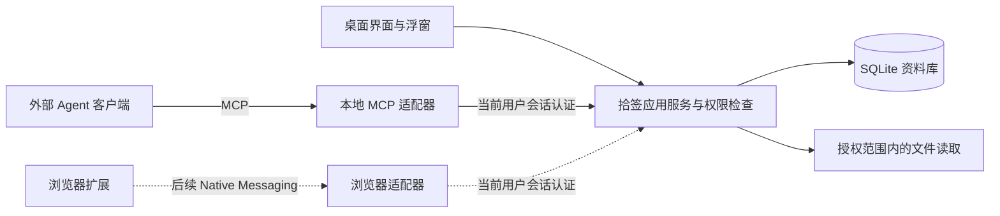

# 拾签与 Agent 的结合分析

分析日期：2026-10-02。依据：桌面端 v0.2.0 源码、现有浏览器协同设计，以及文末官方协议资料。本文提出的 Agent 能力均未实现，也未接入任何模型服务。

## 1. 结论与定位

**可以结合，而且与拾签“整理后能再次找到”的目标相符。** 最先值得做的是“用自然语言找资料”和“为选中文件提出整理建议”，随后再增加经用户确认的批量标注。

建议让拾签成为 Agent 可调用的本地资料工具：拾签负责文件身份、标签、版本、权限和可靠写入；模型负责理解意图、提出分类与组织检索步骤。先提供少量稳定工具，后续再决定是否在软件内增加对话入口。

当前应继续完成 v0.2.1 的浮窗稳定性工作。Agent 的只读原型可在这一轮完成后独立开发，不必等待浏览器插件，也不应让其拖延基础文件操作的修复。

## 2. 哪些用户场景最有价值

| 场景 | 用户表达 | Agent 做什么 | 当前缺口 | 建议顺序 |
| --- | --- | --- | --- | --- |
| 自然语言查找 | “找出品牌升级里还没处理的参考图片” | 查询已有标签，将条件转换为检索，再返回可点击文件卡片与匹配理由 | 工具接口、语义到查询条件的转换 | 第一阶段 |
| 整理建议 | “看看这 20 张图片适合贴什么标签” | 优先复用既有标签，给出逐文件建议和理由 | 受限内容读取、图像理解、建议列表 | 第二阶段 |
| 批量标注 | “把刚才确认的 12 张图标成参考素材” | 展示变更预览，确认后一次提交，返回变更记录 | 持久任务、确认绑定、幂等提交和精确撤销 | 第二阶段 |
| 项目资料助手 | “整理品牌升级项目的资料清单” | 汇总匹配文件、已有备注和来源，按项目组织可点击结果 | 长任务编排、来源引用、集合或导出能力 | 后续阶段 |
| 内容检索 | “上次那张偏暖色、带圆形图案的封面” | 根据图像语义或描述检索并排序 | 图像描述、向量索引、增量更新与效果评测 | 后续阶段 |
| 网页采集辅助 | “把当前网页整理进这个项目” | 接收用户采集的链接或摘录，建议项目标签并保留来源 | 浏览器插件、网页资料模型、本地桥接 | 浏览器协同完成后 |
| 标签治理 | “这几个标签是不是重复了” | 找出候选同义标签，说明影响范围，提出合并方案 | 标签合并业务逻辑、引用迁移和恢复 | 标签治理完成后 |

第一阶段只能基于现有名称、标签和备注查询。“图片是什么内容”“文档正文写了什么”不能从标签搜索推断，需要后续内容提取或多模态能力。按修改日期查询也不能等同于“用户上次看过它”，当前没有访问历史。

## 3. 现有架构能复用什么

| 已有实现 | 可以复用的能力 | 接入时要补的部分 |
| --- | --- | --- |
| [`lib.rs`](../src-tauri/src/lib.rs) 的 `dispatch` | 已有查询、标签、备注、导入、备份等命令入口 | 当前依赖 Tauri 状态与窗口句柄，应抽出不依赖界面的应用服务 |
| [`db.rs`](../src-tauri/src/db.rs) 的 `Store` | SQLite 查询、事务、标签关联、版本检查和撤销 | 受限结果投影、稳定错误类型、客户端身份、跨会话操作记录 |
| [`model.rs`](../src-tauri/src/model.rs) 的 `Query` | 名称／备注／标签搜索和类型、日期、目录等筛选 | 严格校验允许条件，明确时间语义，限制返回条数 |
| [`annotation.rs`](../src-tauri/src/annotation.rs) | 批次标注、自动入库、重复关联去重、失败回滚 | 不能把新增标注的幂等性当成请求级幂等；需预览、确认、版本复查与 request ID |
| [`fsops.rs`](../src-tauri/src/fsops.rs) | 文件身份、可用性、受限预览与手动重新关联 | 面向 Agent 的内容授权、文本提取上限和引用定位 |
| [`backup.rs`](../src-tauri/src/backup.rs) | 备份与恢复保护 | 新增 Agent 数据表的迁移、备份范围与兼容性 |

目前资料库以本地 `files` 为中心，搜索使用名称、备注与标签的文本匹配，没有正文全文索引和向量索引。`Store` 被进程内互斥锁串行访问，撤销只保留会话内最近 20 步。外部 Agent、浏览器桥接和桌面程序不宜各自另开写库进程：即使 SQLite 支持锁，也无法自动共享撤销历史、任务状态和界面事件。

已有 Tauri 窗口能力配置负责 WebView 权限；新增外部接口还需要单独的身份与授权检查，不能把窗口配置当成外部客户端认证。Tauri 官方对能力与窗口／WebView 的关系有明确说明。[Tauri capabilities](https://v2.tauri.app/security/capabilities/)

## 4. 推荐的接入方式

### 4.1 先让外部 Agent 使用拾签工具

推荐先实现本地 MCP 适配器。MCP 提供 Tools、Resources、Prompts 等能力表达方式，可以把检索与受控操作开放给兼容客户端；MCP 本身不提供模型、图像理解或自动整理算法。[MCP server concepts](https://modelcontextprotocol.io/docs/learn/server-concepts)

首版建议使用 stdio 启动适配器，并由适配器通过限定当前用户、带会话认证的 Windows 命名管道连接桌面进程。桌面未启动时返回清晰的启动提示，暂不承担后台常驻服务的复杂性。传输方案与具体协议版本需要在实现时按所选 SDK 和目标客户端验证；stdio 是外部客户端与适配器的传输方式，命名管道是拾签内部通信设计。[MCP architecture](https://modelcontextprotocol.io/docs/learn/architecture)

上图是目标架构。MCP 适配器、命名管道、应用服务抽取和浏览器适配器都属于新增开发内容。

### 4.2 再考虑内置整理助手

内置入口可放在文件多选工具栏的「整理建议」，浮窗中保留一个轻量入口。选中文件后显示建议标签、理由与来源；用户能逐项接受、编辑或忽略。

内置助手与外部 MCP 客户端应调用同一应用服务。是否引入 Agent 框架，由工具编排、重试、任务恢复和评测复杂度决定；仅调用一次模型生成标签建议，通常不需要完整的自主任务循环。

### 4.3 浏览器协同共用业务服务

浏览器仍使用 Native Messaging 与本机桥接程序连接。Chrome 要求扩展声明 `nativeMessaging`，原生主机配置允许的扩展来源；内容脚本需要经扩展页面或 service worker 转发。它与 MCP 是不同协议，不应把二者当作可直接互通的接口。[Chrome Native Messaging](https://developer.chrome.com/docs/extensions/develop/concepts/native-messaging)

浏览器采集、桌面标注和 Agent 操作最终进入同一业务服务。网页链接、摘录和托管图片需要先完成统一资料模型及迁移，再开放相应 Agent 工具。

## 5. 第一批工具与读写边界

以下为建议接口名称，当前源码尚未提供：

| 工具 | 作用 | 初期权限与限制 |
| --- | --- | --- |
| `search_files` | 按名称、标签、备注和现有条件查询 | 只读；分页；默认每次最多 50 项；返回 ID、展示名、标签和匹配依据 |
| `list_tags` | 获取可选标签与使用数量 | 只读；不通过会初始化预设的 `floating.presets` 间接实现 |
| `get_file_metadata` | 查询指定文件的可用性与标注 | 只读；仅已授权资料范围；绝对路径按客户端需要单独授权 |
| `read_file_excerpt` | 读取选定文件的有限文本片段 | 第二阶段；按文件授权，返回截断状态、版本与来源位置 |
| `propose_tag_changes` | 生成可供用户审核的变更计划 | 不修改文件标签；输出 plan ID、文件版本、标签 ID、理由和数量 |
| `apply_tag_plan` | 执行已确认的计划 | 用户界面确认并绑定计划摘要、范围和有效期；一次性令牌；冲突重新审核 |
| `get_operation` | 查询任务与实际修改结果 | 返回操作状态和逐项结果；客户端重试可复用结果 |
| `revert_operation` | 撤回指定操作新增的标注 | 第二阶段；检查后续修改，不能简单调用全局 `undo` 撤销其他用户操作 |

第一批不提供任意 SQL、任意 Shell、删除原文件、恢复整库或不受限制的路径读取。读取元数据也会把这些信息交给所连接的 Agent 客户端；“数据库在本地”并不代表“模型推理也在本地”。

## 6. 批量操作如何做到可检查、可恢复

1. **限定范围**：用户选择文件、集合或明确目录；模型不自行扩大到整盘。
2. **生成建议**：引用既有标签 ID；新标签单独列出。按文件显示建议来源、理由和可编辑结果。模型输出的置信度只能作提示，不能当成准确率或自动执行许可。
3. **确认计划**：应用生成计划摘要和有效期；确认绑定具体内容及文件／标签版本。对话中一个通用的“是”不能作为任意后续写操作的通行证。
4. **原子执行**：批次先检查全部权限和版本，再在事务中提交；冲突时取消该批次并重新预览。大任务拆成独立可见批次，明确哪些批次已经成功。
5. **保存记录**：持久化操作 ID、请求幂等键、状态、作用范围、前后差异、时间与来源。避免保存未经需要的原文、完整提示词和密钥。
6. **精确撤回**：撤销本次新增关联，保留此前及之后的用户修改；进程退出后仍能找到操作记录。原有 20 步会话撤销只可作为参考实现。

建议新增 `agent_jobs`、`change_plans`、`operation_log` 及按需要独立存储的内容派生索引。以上为候选设计，落地前需编写迁移、旧版本拒绝写入和备份恢复测试。索引应绑定文件 revision、提取器／模型版本和权限范围，文件更新或授权撤回时能够失效。

## 7. 模型、内容与性能选择

| 路线 | 适用情况 | 主要代价 |
| --- | --- | --- |
| 外部 Agent + 拾签只读工具 | 快速验证自然语言检索价值 | 使用体验依赖客户端；需说明返回的数据将流向何处 |
| 软件内接云模型 | 图片理解、标签建议，且用户接受选定内容发送到模型服务 | 网络延迟、按量费用、凭据管理和内容范围控制 |
| 软件内接本地模型 | 希望内容留在设备且硬件足够 | 模型下载、内存／显存需求、推理速度和效果验收 |
| 本地检索 + 按需模型理解 | 文件较多，想控制调用量 | 需维护内容提取、缓存与索引失效机制 |

首版建议只处理用户选中的少量文件，缓存以内容版本和模型配置为键，提供取消、进度、重试和预算上限。不要在启动时自动扫描整盘并上传图片。

从网页、PDF、文件名和备注读到的指令都属于资料内容，不能改变工具权限。模型可以提出操作，最终范围、路径解析、大小限制和写入规则必须由应用服务校验。首次模型读取要明确是仅元数据、文本片段还是图片副本；云服务凭据使用操作系统凭据存储，避免写入前端配置和标注备份。

## 8. 分阶段实施与验收

| 阶段 | 工作 | 退出条件 |
| --- | --- | --- |
| A：只读原型 | 抽取查询服务；本地 IPC；MCP 检索、标签列表和元数据工具；最小授权 UI | 用合成库完成自然语言查询；越界访问全部拒绝；客户端退出不影响桌面；无写操作 |
| B：整理建议 | 选中文件授权；一个模型适配器；建议面板；有限文本／图片读取 | 用户能编辑或拒绝建议；每条建议可定位来源；取消、超时和网络失败可恢复 |
| C：受控写入 | 计划确认、请求幂等、持久操作记录、版本检查与精确撤回 | 重试不重复写；冲突不覆盖；重启后可追踪；混合有效／无效批次不部分落库 |
| D：扩展资料范围 | 与浏览器采集整合；正文／图像索引；智能集合与项目资料清单 | 本地文件与网页可统一查找；更新和删除后索引同步；来源引用正确 |

建议用 30～50 条真实检索意图与一组经用户确认的图片分类样本建立评测集。记录查询条件正确率、结果相关性、建议采纳率、误标率、撤回成功率、P95 延迟和每批实际成本。先得到基线再决定是否引入向量数据库、更复杂的 Agent 循环或后台自动整理，避免用主观“更智能”判断是否完成。

本文不承诺工期；阶段 A 的工作量主要取决于应用服务抽取、跨进程授权和目标 MCP 客户端的实际兼容验证。

## 9. 推荐下一步

保持既定的浮窗稳定性优先级。随后先实现 **“只读 MCP + 自然语言查找”**，用现有标签和备注验证价值；再加入 **“选中文件 → 标签建议 → 用户确认 → 可撤回提交”**。浏览器插件与内容语义索引按既有路线推进，共用同一应用服务和资料模型。
