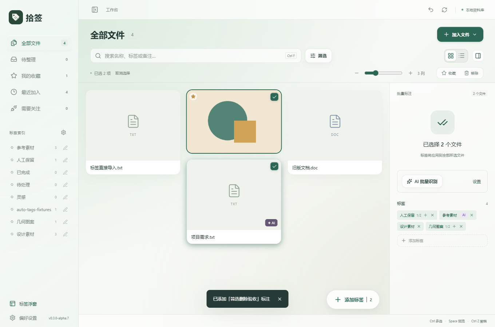
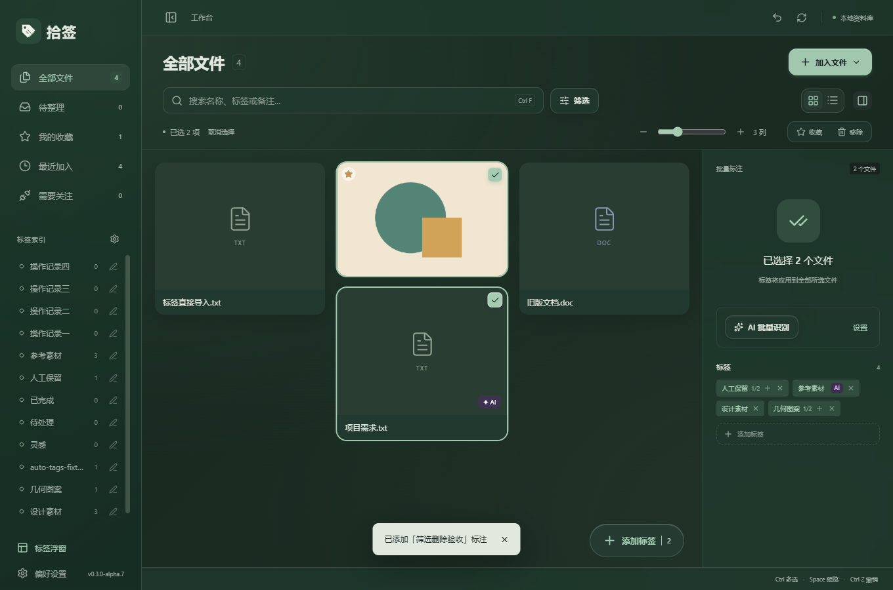
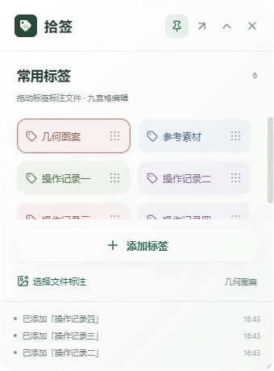
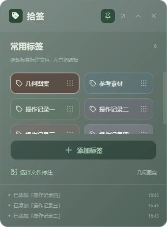

# 拾签 v0.3.0-alpha.7：Apple 风格与标签流程调整

更新日期：2026-10-09

## 界面与多选

工作台与标签浮窗统一采用更接近 Apple 的控件风格：系统字体、圆角按钮、轻量高光与阴影、分段切换控件，以及圆角方形的多选勾选标记。浅色与深色模式保留现有绿色主题色，选中的文件显示主题色描边。弹窗、搜索框、标签菜单与浮窗采用一致的表面层级。

图库卡片不进行缩放位移，避免影响瀑布流的尺寸测量；系统减少动态效果设置继续有效。Windows 原生标题栏主题同步、浮窗调节大小与置顶控制仍然保留。

## 通过标签导入与 AI 识别

- 从浮窗选择文件标注、将文件拖到标签，或通过标签标注操作导入新文件时，添加指定标签和文件夹标签，不自动加入 AI 识别队列。
- 工作台普通「加入文件」继续遵循 AI 自动标注设置。
- 用户仍可在文件详情中主动发起 AI 识别。对已经通过普通导入排队的任务，后续添加人工标签不会自动取消任务。

## AI 标签进入标签库的规则

AI 新生成的标签首先是文件上的待确认建议，保留 AI 来源标记，但不进入侧栏标签索引、添加标签候选列表或浮窗常用标签候选列表。模型匹配已有标签时也只使用已认可的标签池。

用户确认后，该文件上的 AI 标识消失，标签进入标签池并自动加入常用标签浮窗。其他文件上尚未确认的同名建议仍保留自己的 AI 标记。

移除 AI 标签时，如果它已经没有任何文件关联，自动删除标签库中的对应 AI 标签。若仍有其他文件使用，保留共享标签；若只剩待确认关联，它不再出现在已认可标签池中。全局「删除标签」则删除该标签及所有文件关联。人工创建或明确复用为人工标签的记录不按 AI 孤立标签规则清理。

工作台原有撤销可以恢复移除的关联和必要标签元数据；待确认标签恢复后仍不会进入添加标签列表。

## 删除标签时保留文件详情

移除文件上的标签、全局删除标签，或删除当前筛选标签时，不再清空当前单文件选择。删除筛选标签会清理失效筛选条件，同时保留详情。

如果当前文件因修改标签离开筛选结果，列表会正常更新，右侧仍显示该文件的最新详情，直到用户切换选择或查询。实际移除文件时仍正常清理选择。

## 浮窗最近三步操作

浮窗底部改为最多三条最近操作，最新记录在上方，显示简短内容和时间。记录添加、标注、重命名、删除、移出浮窗与标签导出的成功结果。就绪状态、拖动提示与错误不会占用三条记录。

记录按资料库分别保存在本机，重新打开浮窗后保留。浮窗的撤销按钮已删除，工作台原有撤销入口保留。记录不是待执行任务或完整审计日志。

## 验证记录

全部桌面验收使用独立 QA 资料库与合成文件，AI 流程使用本机模拟模型服务验证真实请求、队列和数据库写入。

| 检查                                       | 结果                                                             |
| ------------------------------------------ | ---------------------------------------------------------------- |
| Rust 核心测试                              | 67 项通过，1 项需要可观察 Windows Shell 环境的测试按既有规则跳过 |
| AI 导入、确认、重新识别、取消、备份        | 10 组通过                                                        |
| 标签库清理、详情保留、多选、三条历史与主题 | 6 组通过                                                         |
| 瀑布流布局                                 | 35 个场景通过                                                    |
| 标签编辑与文件夹导出                       | 5 组通过                                                         |
| 原生主题、置顶、尺寸、点击层级             | 6 组通过                                                         |
| 浮窗标注与已有流程                         | 10 组通过，撤销在工作台执行                                      |
| TypeScript、Vite、Windows EXE 与 NSIS      | 构建通过                                                         |

详细日志保存在 `docs/evidence/apple-tags-*.log`。本次未对真实模型标签准确率、完整物理鼠标跨窗口拖拽、多屏混合 DPI 或全新 Windows 系统安装作出验收结论。

## 界面预览

| 浅色浮窗                                                      | 深色浮窗                                                     |
| ------------------------------------------------------------- | ------------------------------------------------------------ |
|  |  |

## 使用新版

交付文件位于 `D:\AI\Shiqian\releases\v0.3.0-alpha.7\`：

- `Shiqian-v0.3.0-alpha.7-Windows-x64-setup.exe`：推荐安装包。
- `Shiqian-v0.3.0-alpha.7-Windows-x64.exe`：单文件程序，需要电脑已有 WebView2，资料库仍存储在用户数据目录。
- `Shiqian-v0.3.0-alpha.7-source.zip`：本次源码、文档与验证记录，不含个人资料库和测试文件。
- `SHA256SUMS.txt`：交付文件校验值。

先关闭旧版标签浮窗，再退出旧版工作台，然后安装或启动新版。现有个人资料库无需重新导入；此前未确认的 AI 新标签会按新规则隐藏于添加标签候选列表，仍可从文件详情确认或移除。
