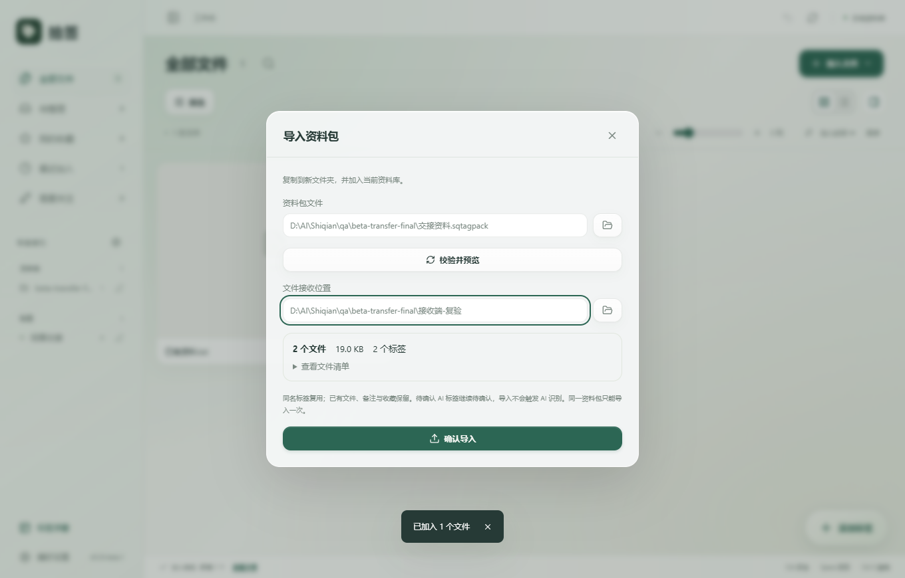

# 拾签 v0.3.0-beta.1：稳定与交付

日期：2026-10-10。状态：Beta 候选，可供小范围同事试用。主项目：`D:\AI\Shiqian`。

本轮加入文件与标注一起交接的资料包，验证旧版本升级、恢复、异常退出与规模化查询。既有 Apple 风格、主题色、浮窗、AI 确认规则与动效继续保留。干净系统安装、多屏混合 DPI、真实跨窗口手势与全天运行仍需实机验收。

## 给同事的最短流程

发送两项：本版本的 Windows x64 安装包，以及你从软件导出的 `.sqtagpack` 资料包。一般不需要发送源码、用户数据目录、AI 配置或开发工具。

1. 你在工作台选中文件，点击操作栏的「导出资料包」。也可进入「偏好设置 → 资料交接 → 导出资料包」，选择全部文件或某个标签。
2. 查看文件清单与容量，选择新的 `.sqtagpack` 文件名，执行导出。若文件缺失或发生变化，先刷新状态或重新关联；本版不会悄悄遗漏它们。
3. 同事安装拾签，打开「偏好设置 → 资料交接 → 导入资料包」。
4. 选择资料包，点击「校验并预览」，选择文件接收目录，再点击「确认导入」。
5. 文件复制到接收目录内的新资料文件夹，工作台会出现对应资料、标签、备注与收藏，可直接查找使用。

`.sqtagpack` 是带清单的 ZIP，原文件不需要安装拾签也能取出；可复制资料包并将副本改为 `.zip` 后解压。只解压不会自动向拾签恢复标注，完整恢复请走软件导入。

资料包不加密；包含你选定的文件和文字标注。确认所选资料适合分享后再发送。AI 服务配置和密钥不在其中。

## 三种导出如何选择

| 方式 | 包含内容 | 接收或恢复行为 |
| --- | --- | --- |
| 同标签文件夹导出 | 原文件副本、导出清单 | 可直接交给任何人使用；没有标注恢复 |
| `.sqtagbackup` 标注备份 | 标注库、文件位置、界面设置；不含原文件与 AI 服务配置 | 替换当前标注库；自动保存恢复前备份；原文件需在记录位置 |
| `.sqtagpack` 资料包 | 原文件、标签关系及来源、AI 建议确认状态、备注、收藏、加入时间 | 复制文件并追加到当前库；不覆盖已有资料，不触发 AI 识别 |

## 资料包规则

- 单包最多 10,000 个文件、8 GB 原文件总量，清单最多 32 MB。分批交接更大的资料集。
- 支持全部文件、指定标签、工作台所选文件。预览列出数量、容量及前 100 项文件；完整清单保存在包内。
- 预览后资料发生变化时，关闭对话框再打开以重新预览。
- 原文件名保留。每个文件置于独立编号子目录中，同名文件保持独立；修改时间与加入时间保留。接收路径重建为本机位置，无需沿用发送端盘符。
- 同名标签按现有名称归一规则复用。当前库已有文件、备注与收藏保持不变；新资料作为独立副本加入。不会按内容散列自动覆盖或合并既有文件记录。
- 普通、文件夹及 AI 标签来源保留。原文件夹标签作为交接快照保留；以后主动补齐文件夹标签时按接收端父目录更新。
- 未确认 AI 建议仍在对应文件上待确认，不进入可添加标签池；已确认 AI 标签加入浮窗。导入不携带 AI 任务、不启动识别。
- 同一资料包在同一库只允许导入一次；不同接收端可各导入一次。需要再次交接更新资料时，由发送端重新导出新包。手工移走已导入文件应使用重新关联。
- 整批标注以 SQLite 事务提交。导入完成后清空会话撤销，避免历史操作与新增关系冲突；如需移除导入记录，可在工作台选择移除，原副本保留。
- 输出包使用临时文件，完成并同步后才发布；已有包不会覆盖，请换文件名。接收目录中的既有文件夹也不会覆盖。
- 对清单及每个原文件核对 SHA-256，拒绝额外条目、重复条目、路径越界与链接。导入确认时再次校验，发现与预览不一致则停止。
- 大文件以 64 KB 缓冲区流式读写；进度为累计已处理字节，校验与复制各计算一次，因此不是单次文件容量百分比。
- 执行期间可取消。常规取消或失败会回滚新增标注并清理本次创建的文件，不递归删除接收目录。
- 异常退出后，SQLite 保持整批提交或未提交；复制到一半的文件保留。下次启动显示恢复提示，并在数据目录 `backups/transfer-recovery-*.txt` 保存说明。按提示检查残留目录，移走或删除后重试，软件不会自动删除用户目录。

## 安装与升级

本地交付目录：`releases/v0.3.0-beta.1/`。

- 推荐发送 `Shiqian-v0.3.0-beta.1-Windows-x64-setup.exe`。安装器按当前用户安装，包含 WebView2 检查；没有 Runtime 的电脑可能需要联网完成依赖安装。
- EXE 单独运行仍依赖系统 WebView2，并使用用户应用数据目录。它不是自动把资料库存放到程序旁的便携版本。
- 升级前从旧版本导出 `.sqtagbackup`；有重要资料时另存 `.sqtagpack` 或备份原文件。退出拾签及标签浮窗后安装新版。
- 使用同一 Windows 用户与默认资料库，新版会读取原有数据。本轮保持数据库 schema 2；schema 1 仍保留迁移前保护副本后升级。
- 打开后核对文件数量、标签、备注、收藏与外观设置。发现异常先保留数据目录，再使用恢复前备份定位。
- GitHub 下载入口：[v0.3.0-beta.1 预发布](https://github.com/SACO1F/Shiqian/releases/tag/v0.3.0-beta.1)，包含安装包、EXE、源码、说明、验收记录与 SHA-256 校验文件。

## 实测与待验收

测试使用隔离的 `qa/` 资料库及合成资料，未修改个人资料库。验证结果及实测数据见 [Beta 验收记录](validation-v0.3-beta1.md)。

干净 Windows 虚拟机／另一位同事电脑上的安装、缺少 WebView2 的首次启动、覆盖安装与卸载保留数据，以及 100%／125%／150% 混合 DPI 的双屏拖拽仍列为待验收。持续操作基线不等于全天稳定性认证。当前交付用于小范围反馈，完成这些项目后再扩大分发。

开发格式与 API 约定见 [资料包格式 v1](transfer-package-format-v1.md)。
