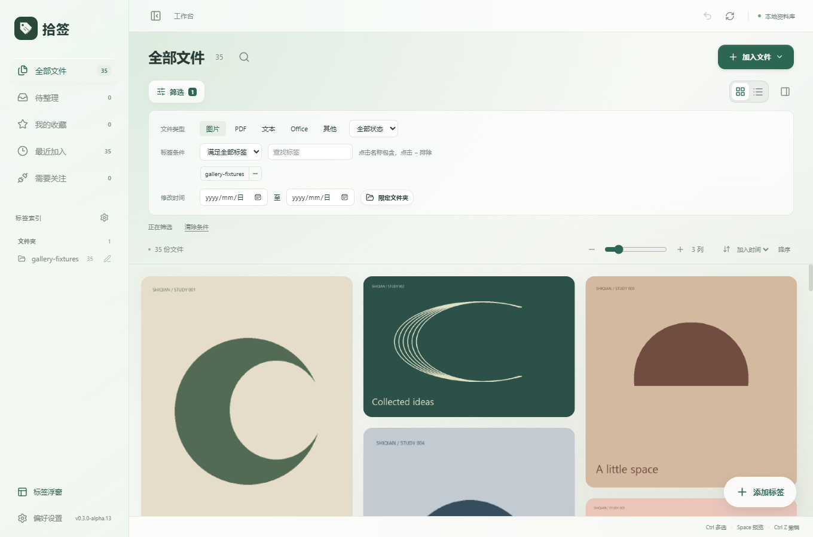
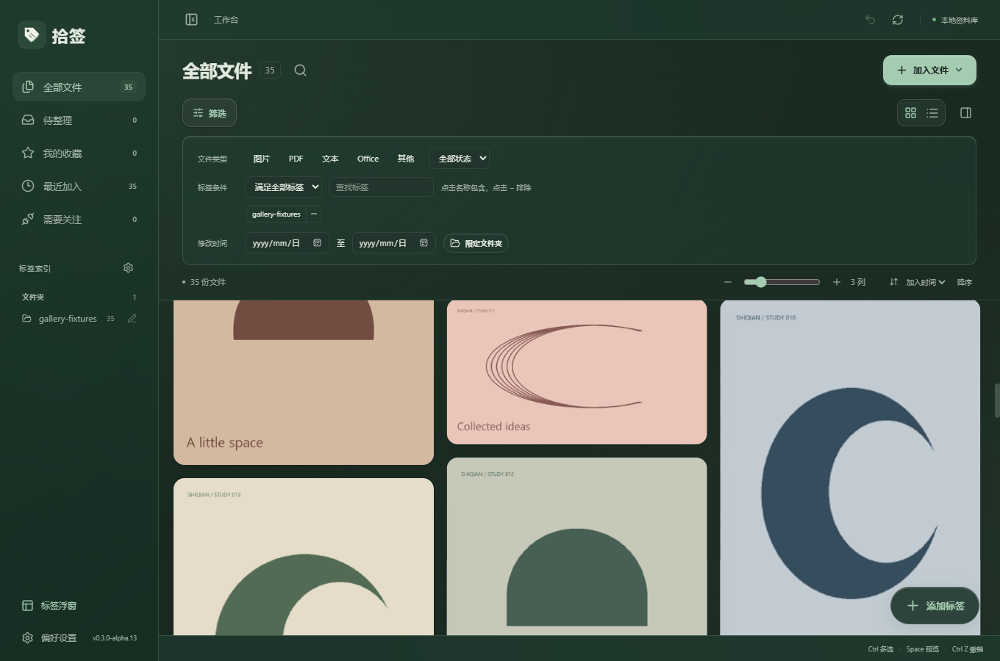
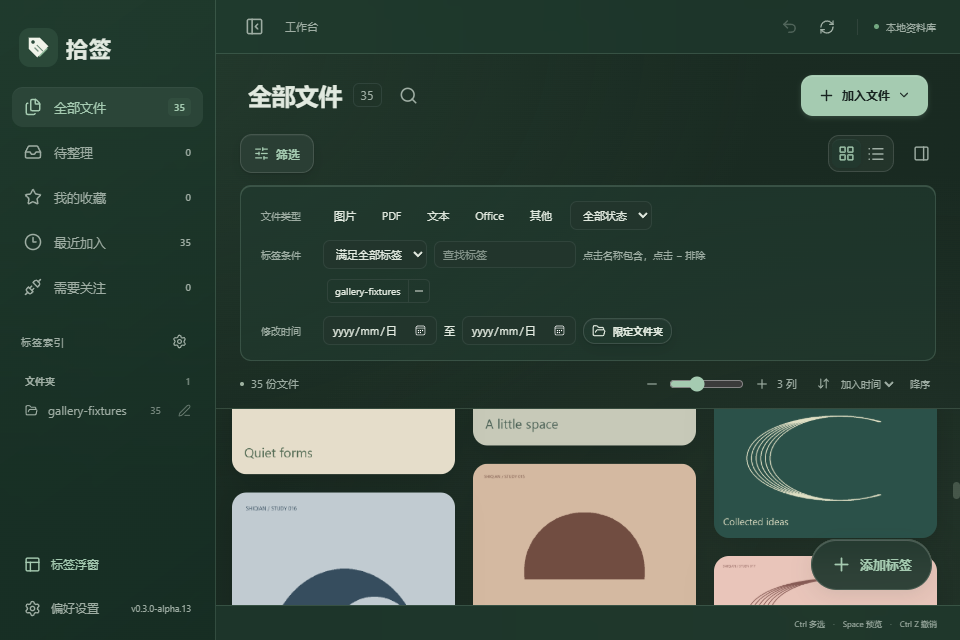

# 拾签 v0.3.0-alpha.13：筛选动效与视图切换稳定性

更新日期：2026-10-09

## 筛选面板过渡

筛选面板展开和收起采用约 260 毫秒的高度过渡，并配合淡入淡出。连续快速点击会从当前状态平滑转向新的状态，最终状态与按钮一致。

收起面板保留筛选条件，同时让隐藏控件不可聚焦和点击；再次打开无需重新填写。系统选择减少动态效果时，关闭过渡动画。

## 瀑布流与列表切换

旧版有两类位置变化：两种视图使用不同的顶部栏、标题与间距；切回瀑布流时先使用默认图片比例，再等待图片加载更新尺寸。旧版合成文件复现中，文件区域的顶部位置相差 35 像素，切回瀑布流时出现多次卡片重新定位。

新版统一两种视图的顶部栏高度、标题字号与间距，文件区域的位置保持一致。缓存已加载的预览结果、图片比例及卡片测量结果，切回视图时可以直接按已知尺寸排布。缓存按文件身份与预览版本区分，限制条目数量；刷新预览时会清理缓存。

瀑布流和列表分别记住滚动位置。切换视图时恢复对应位置，避免沿用另一种布局的偏移。列表仅在启用时进行虚拟布局，固定滚动条留白，并关闭浏览器自动滚动锚定，减少尺寸调整带来的跳动。

首次载入尚未生成预览的文件仍需等待预览生成。

## 验证

使用独立 QA 资料库与合成文件，不操作个人资料库。旧版复现记录见 `docs/evidence/filter-layout-baseline.log`。

- 专项 4 组通过，覆盖展开与收起中间帧、快速反向点击、条件保留、四次视图往返、工作区绝对位置、分别恢复滚动位置、浅深主题、窄窗口和减少动态效果。
- 记录帧确认已加载瀑布流返回时没有加载占位，也没有卡片重新定位。
- 瀑布流 35 个布局场景、完整标签及浮窗 7 组、搜索与遮罩 6 组回归通过。
- TypeScript、Vite、Windows EXE 和 NSIS 安装包构建通过。

新版验证记录见 `docs/evidence/filter-layout-*.log`。本次未验证全新 Windows 安装或多屏混合 DPI。

## 使用新版

交付文件位于 `D:\AI\Shiqian\releases\v0.3.0-alpha.13\`：Windows x64 安装包、单文件 EXE、源码 ZIP、说明和 SHA256 校验文件。

先关闭旧版标签浮窗，再退出旧版工作台，然后安装或启动新版。已有资料库无需重新导入。

## 界面预览

