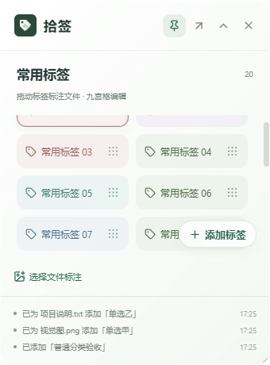
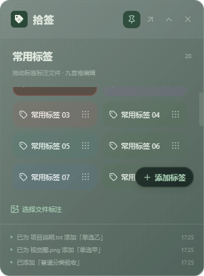
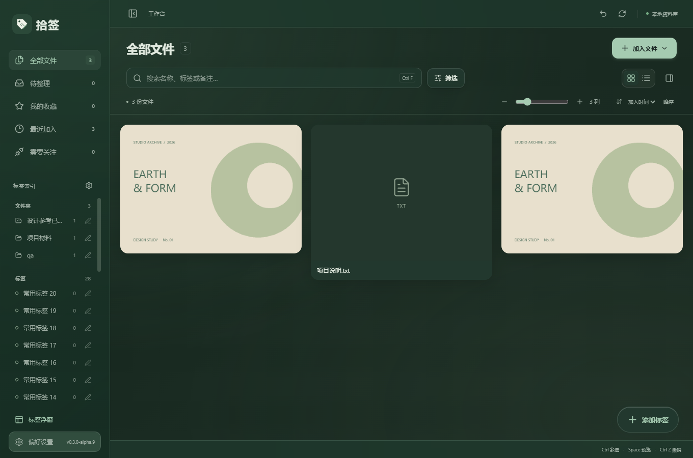

# 拾签 v0.3.0-alpha.9：浮窗层级与侧栏交互修正

更新日期：2026-10-09

## 浮窗添加按钮

添加标签按钮移入标签区的右下角，位于「选择文件标注」栏上方。它采用独立定位和更高的显示层级，不随标签滚动。滚动时标签从按钮下方经过，按钮仍可点击；鼠标停在按钮上使用滚轮，也会继续滚动标签列表。

按钮保留小型胶囊、绿色主题与玻璃效果，增加底色浓度和背景模糊，避免下方标签文字干扰按钮文字。标签列表底部留有滚动空间，最后一项可以滚动到按钮上方，避免永久遮挡其编辑按钮。最近三步操作记录仍单独显示在底部。

## 标签边缘

移除未选中标签卡片周围的白色边框和白色内侧高光。浅色、深色模式继续使用标签自己的柔和色块区分卡片；选中状态使用同色系边缘和背景加深，拖入文件时保留目标反馈与键盘焦点提示。

## 侧栏底部按钮

「标签浮窗」与「偏好设置」采用 12 像素圆角，对称的上下内边距及按钮内部高亮。背景和描边跟随按钮轮廓，图标垂直居中，不再出现偏移的长方形高亮。侧栏收拢后同样保持圆角与图标居中。

## 侧栏标签单选

点击侧栏标签只选择当前这一项，点击另一个标签时替换此前选择；文件夹标签与普通标签共用这一单选规则。再次点击当前标签会取消标签筛选。

侧栏单选会清除此前的标签包含和排除条件，避免组合条件影响单选结果。搜索文字、文件类型等其他查询条件保留。「筛选」面板继续提供组合标签查询。

## 验证记录

使用独立 QA 资料库与合成图片、文本文件，不操作个人资料库。

- 核心测试：70 项通过，1 项需要可观察 Windows Shell 环境的测试按既有规则跳过。
- 本次桌面专项：5 组通过，覆盖跨分组单选、再次点击取消、展开/收拢时的按钮轮廓、滚动中的固定坐标、标签在按钮下方时的点击命中、按钮上的滚轮、白边清理与最小尺寸。
- 分组与添加限制 6 组、浮窗标注流程 10 组、原生窗口控制 6 组、标签编辑与导出 5 组均通过。
- TypeScript、Vite、Windows EXE 和 NSIS 安装包构建通过。

详细结果见 `docs/evidence/floating-overlay-*.log`。专项通过实际 WebView 操作、原生窗口接口与布局命中检查验证；完整物理鼠标跨窗口拖拽、多屏混合 DPI 和全新 Windows 环境安装不属于本次验收。

## 界面预览

| 浅色浮窗                                                                         | 深色浮窗                                                                      |
| -------------------------------------------------------------------------------- | ----------------------------------------------------------------------------- |
|  |  |

## 使用新版

交付文件位于 `D:\AI\Shiqian\releases\v0.3.0-alpha.9\`，提供安装包、单文件 EXE、源码 ZIP、更新说明和 SHA256 校验文件。

推荐运行 `Shiqian-v0.3.0-alpha.9-Windows-x64-setup.exe`。先关闭旧版标签浮窗，再退出旧版工作台，然后安装或启动新版；现有资料库无需重新导入。
