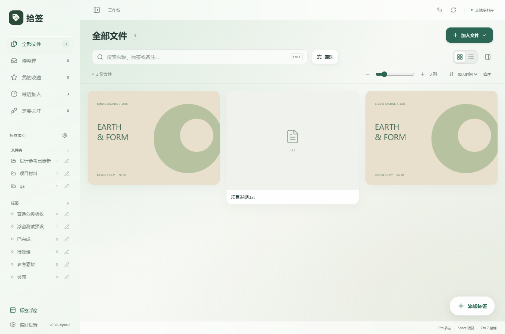
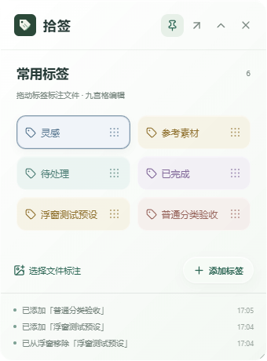
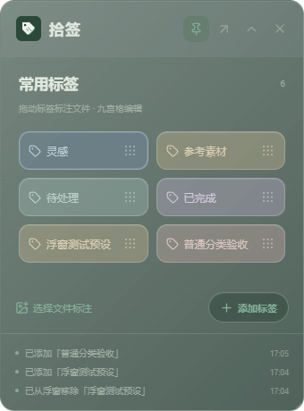

# 拾签 v0.3.0-alpha.8：标签索引分组与浮窗添加按钮

更新日期：2026-10-09

## 侧栏标签索引

标签索引按创建来源分为两组，共用侧栏的滚动区域：

- **文件夹**：由导入时的文件夹自动标注创建，使用文件夹图标。
- **标签**：人工标签和用户已确认的 AI 新标签，保留标签图标。

分组标题显示标签数量，标签行仍显示关联文件数。点击任意标签继续筛选对应文件，重命名仍同步所有关联文件。未确认的 AI 新标签继续只显示在文件详情中。

分组使用资料库保存的创建来源，不根据标签名称猜测。导入复用已有同名普通标签时，保留它原本的来源。

## 文件夹标签不进入标签浮窗

浮窗的已有标签候选列表只提供普通标签与已认可的 AI 标签。文件夹标签不会出现，也不能通过输入同名标签或直接调用保存接口加入浮窗；输入时显示明确提示，保留当前输入和已保存配置。

旧版浮窗配置中的文件夹标签会在读取时隐藏，但工作台中的标签、筛选能力和文件关联保留。确认某个文件上的 AI 关联时，如果对应标签是文件夹来源，同样不会自动加入浮窗。

内置标签名称与文件夹标签重名时，跳过该内置浮窗项，避免启动浮窗失败或改变既有来源。

## 右下角添加按钮

浮窗原来横跨整行的添加按钮改为下方操作区右侧的小型胶囊按钮，34 像素高，保留加号与「添加标签」文字。半透明玻璃表面、主题色与阴影延续工作台悬浮按钮的风格。

左侧继续提供「选择文件标注」，当前目标以标签卡片的选中状态表示。按钮所在操作区固定在可滚动标签列表下方，不覆盖底部最近三条操作记录，收起浮窗时一起隐藏。

## 验证

使用独立测试资料库、合成图片和文本文件，保留个人资料库。

- 核心测试：70 项通过，1 项需要可观察 Windows Shell 环境的测试按既有规则跳过。
- 分组、筛选与重命名、候选限制、同名输入、普通标签添加、窗口尺寸和主题：6 组桌面验收通过。
- 浮窗原有流程 10 组、窗口控制 6 组、标签编辑与导出 5 组回归通过，详细结果见 `docs/evidence/folder-tags-*.log`。
- TypeScript、Vite、Windows 程序与 NSIS 安装包构建通过。

桌面验收通过真实 Tauri 接口和 WebView 操作执行；完整物理鼠标拖动、多显示器混合 DPI 与全新 Windows 环境安装未纳入本次验收。

## 界面预览

| 浅色浮窗                                                        | 深色浮窗                                                     |
| --------------------------------------------------------------- | ------------------------------------------------------------ |
|  |  |

## 使用新版

交付文件位于 `D:\AI\Shiqian\releases\v0.3.0-alpha.8\`。推荐使用 `Shiqian-v0.3.0-alpha.8-Windows-x64-setup.exe`，也提供单文件 EXE、源码 ZIP 和 SHA256 校验文件。

先关闭旧版标签浮窗，再退出旧版工作台，然后安装或启动新版。现有资料库无需重新导入。
