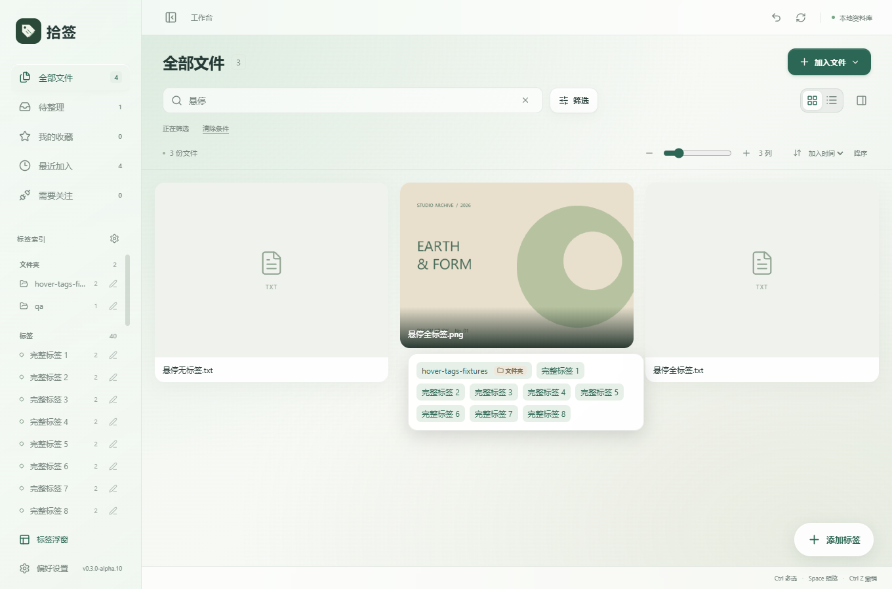
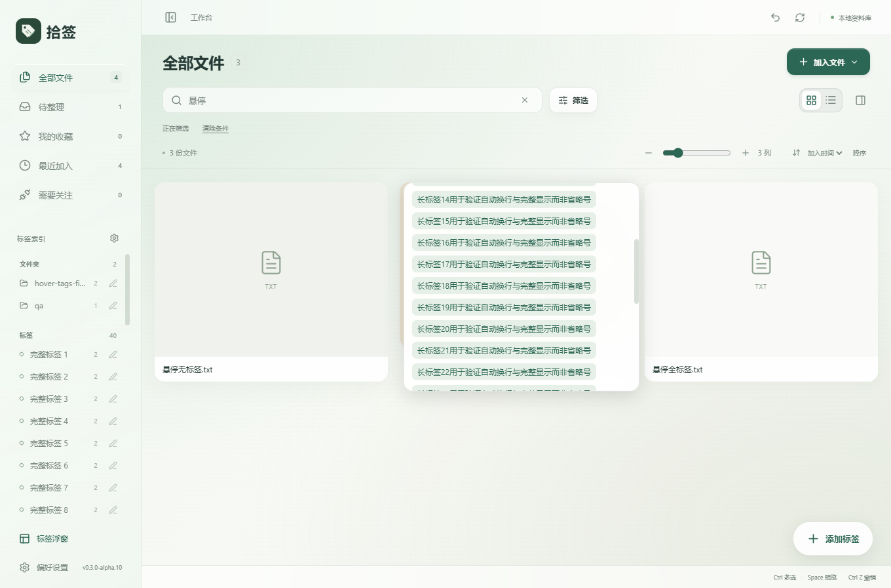
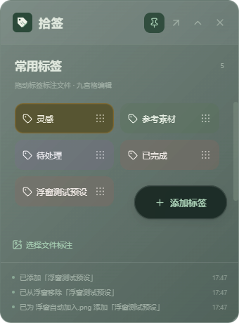

# 拾签 v0.3.0-alpha.10：更大的浮窗按钮与完整标签悬停展示

更新日期：2026-10-09

## 浮窗添加按钮

标签浮窗的添加按钮增高至 48 像素，略高于标签卡片的 43 像素，并加宽到至少 132 像素。继续采用胶囊形状、原有绿色主题及玻璃效果。

按钮固定在标签区右下角、选择文件标注栏上方，滚动标签从它下方经过。列表底部的滚动留白相应增大，保证最后一个标签可以完整移到按钮上方。鼠标停在按钮上时仍可滚动标签。

## 悬停显示全部标签

工作台图片、PDF、普通文件卡片以及列表行统一支持完整标签面板。鼠标悬停或键盘聚焦文件时，显示该文件所有标签；鼠标移到面板中可以继续查看，离开后自动关闭。

图片卡片原先最多显示三个标签，列表最多两个。现在悬停面板完整显示，不再以「+数量」代替剩余标签；列表未悬停时仍保留简短摘要。

标签名称自动换行，保留文件夹来源及未确认 AI 来源标识。数量较多时，面板限制最大高度并提供内部滚动，不裁切剩余标签。无标签文件不显示空面板。

面板通过独立浮层显示，不改变卡片高度或列表行高度，不影响瀑布流的尺寸测量。位置限制在窗口内，显示层级低于弹窗；主列表滚动时关闭，避免提示指向已移动的卡片。

## 验证

使用独立 QA 资料库与合成图片、文本文件，不操作个人资料库。

- 专项 6 组通过，覆盖图片完整标签、普通文件的 36 个标签与 40 字符名称换行、面板内滚动、列表完整标签、键盘聚焦、无标签文件、浅深主题及三种原生浮窗尺寸。
- 检查悬停前后卡片边界、文件版本与选择状态不变。
- 瀑布流 35 个布局场景、浮窗标注 10 组、分组限制 6 组、原生窗口控制 6 组回归通过。
- 核心测试 70 项通过，1 项需要可观察 Windows Shell 环境的测试按既有规则跳过。
- TypeScript、Vite、Windows EXE 与 NSIS 安装包构建通过。

结果位于 `docs/evidence/hover-tags-*.log`。本次未对完整物理鼠标跨窗口拖拽、多屏混合 DPI 或全新 Windows 环境安装作出验收结论。

## 界面预览

## 使用新版

交付文件位于 `D:\AI\Shiqian\releases\v0.3.0-alpha.10\`，提供安装包、单文件 EXE、源码 ZIP、说明文档和 SHA256 校验文件。

先关闭旧版标签浮窗，再退出旧版工作台，然后安装或启动新版。现有资料库无需重新导入。
