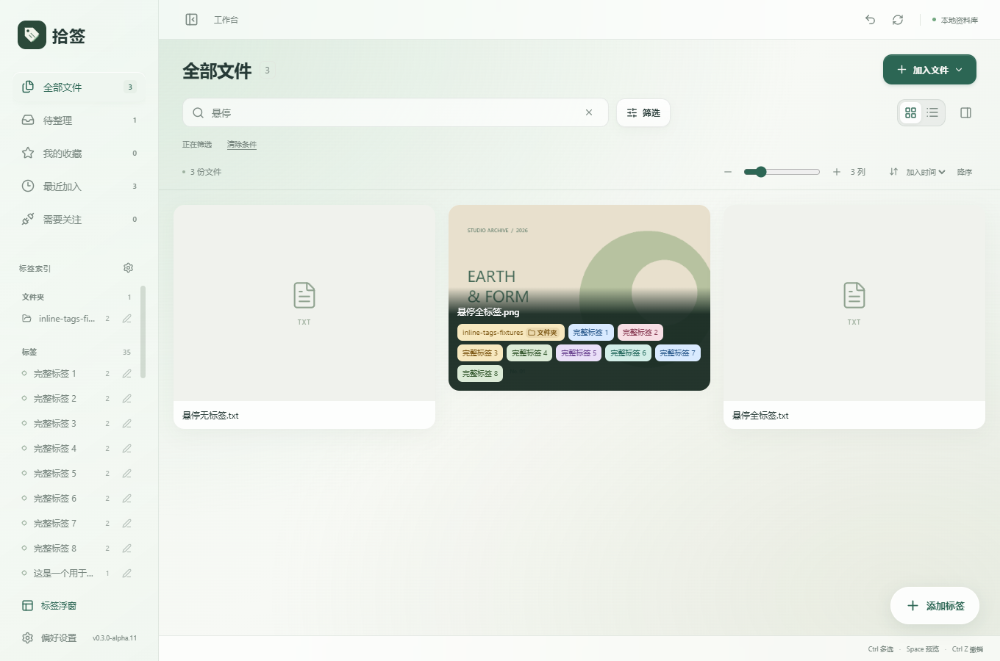
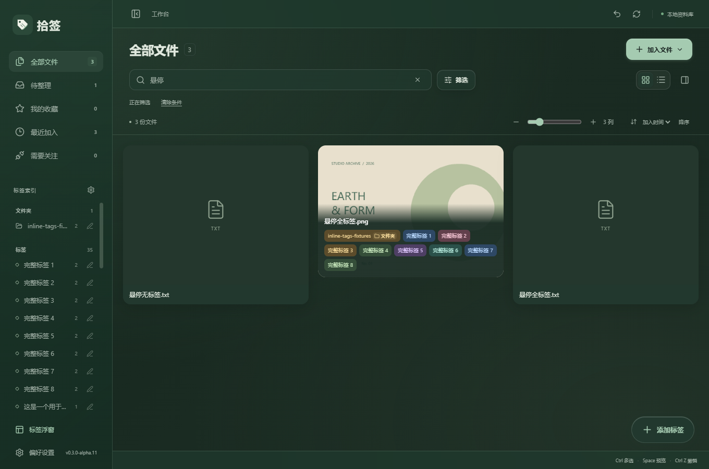
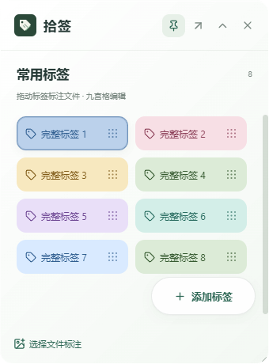
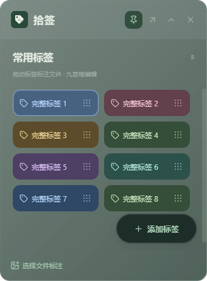

# 拾签 v0.3.0-alpha.11：图片内完整标签与统一配色

更新日期：2026-10-09

## 本次变化

- 图片和 PDF 的完整标签回到预览内部，在悬浮文件名下方显示。普通文件的预览区域采用同样方式。
- 悬停或键盘聚焦显示浮层，离开隐藏；所有标签完整呈现，不用「+数量」替代。长名称换行，标签很多时在图片内滚动；键盘聚焦时可用上下方向键滚动。
- 浮层保持在图片边界内，不改变卡片尺寸及瀑布流布局。列表视图继续使用完整标签面板。
- 标签浮窗增加更清晰的六种配色：绿、蓝、玫瑰、琥珀、紫、青。浅色采用柔和色块，深色采用彩色底与浅色文字。
- 浮窗和图片共用同一个标签 ID 配色规则。同一标签的底色和文字色一致，重命名、排序及切换窗口不会改变对应颜色。选中标签仍有整块高亮和细轮廓反馈。
- 原有绿色主题、玻璃质感、48 像素添加按钮、文件夹与 AI 来源标识继续保留。

## 使用新版

安装包、单文件 EXE、源码 ZIP、说明和 SHA256 校验文件位于 `D:\AI\Shiqian\releases\v0.3.0-alpha.11\`。

先关闭旧版标签浮窗，再退出旧版工作台，然后安装或启动新版。已有资料库无需重新导入。

## 验证

使用独立 QA 资料库与合成文件进行桌面验证，没有操作个人资料库。

- 桌面专项 7 组通过，覆盖图片内全部标签、36 个标签的内部滚动、40 字符名称换行、列表完整标签、键盘聚焦、浅深主题颜色一致，以及三种原生浮窗尺寸的按钮位置。
- 确认悬停前后卡片尺寸、文件版本和选择状态不变。
- 瀑布流 35 个布局场景通过，包括 3/4 列切换、极端长宽比、滚动中更改列数与宽度。
- 六种配色在浅深主题下共 12 对文字/底色的对比度均超过 4.5。
- TypeScript、Vite、Windows EXE 和 NSIS 安装包构建通过。

验证记录见 `docs/evidence/inline-tags-*.log`。本次未验证全新 Windows 环境安装或多屏混合 DPI。

## 界面预览

