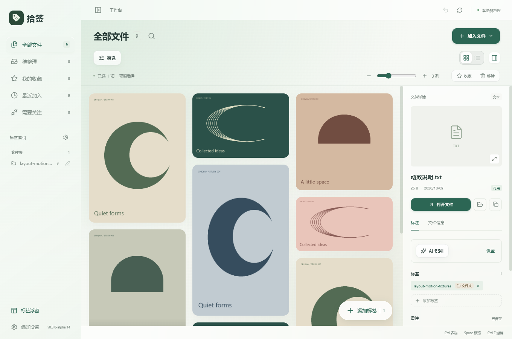
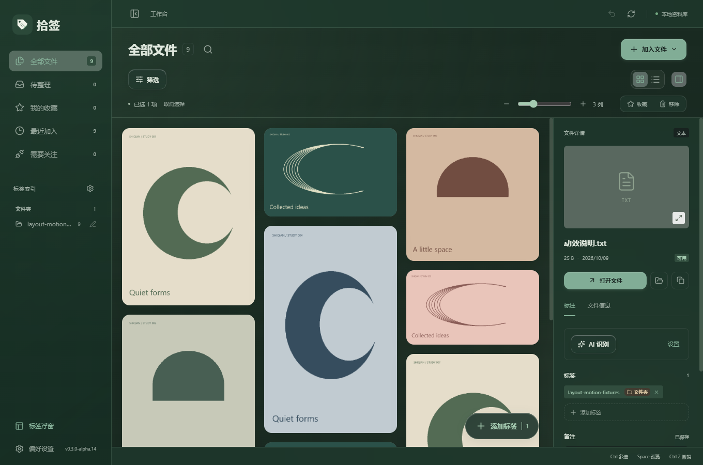
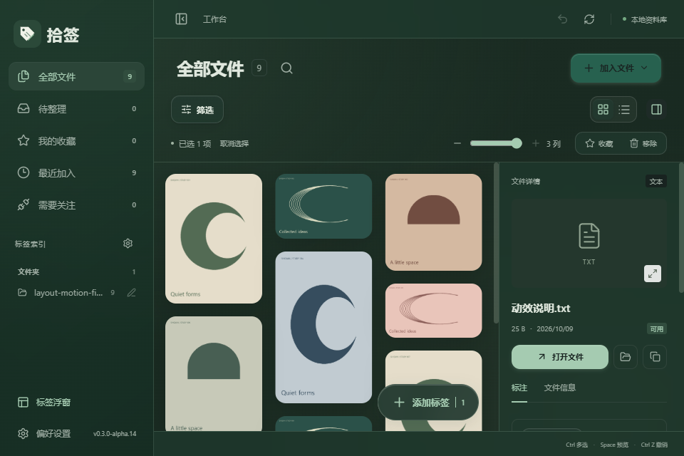

# 拾签 v0.3.0-alpha.14：视图平移与详情展开动效

更新日期：2026-10-09

## 视图切换

瀑布流切换到列表时，列表从右侧轻轻滑入；切回瀑布流时，从左侧滑入。平移距离 16 像素，约 240 毫秒完成，并配合淡入。

只移动文件内容层，滚动容器和工具栏保持稳定。保留两种视图各自的滚动位置及已加载预览尺寸。初次进入工作台不额外播放切换动画。快速切换时取消上一段动效，从当前选择的布局开始。

## 文件详情面板

点击详情按钮后，右侧面板采用约 300 毫秒的宽度展开，内容从右侧轻轻滑入并淡入。收起时反向过渡，文件区随面板宽度平滑调整。

正常窗口保留 290 像素详情宽度，窄窗口使用 260 像素。右下角添加标签按钮随面板移动，避免遮挡详情内容。面板关闭后隐藏控件不可点击和聚焦，保留当前文件和编辑状态。

原有显示规则保持：瀑布流选中文件后显示详情；列表可以显示未选择文件时的提示。系统选择减少动态效果时，关闭视图与详情动效。

## 验证

使用独立 QA 资料库与合成文件验证，没有操作个人资料库。

- 动效专项 4 组通过，覆盖两种平移方向、透明度中间帧、首次载入不播放动效、快速切换取消旧动效、独立滚动位置、详情展开/收起宽度中间帧、隐藏控件不可交互，以及关闭后保留已保存备注与标签。
- 详情面板逐帧展开及收起时，没有发现瀑布流卡片重叠。
- 浅深主题、960×640 窄窗口和减少动态效果验证通过。
- 筛选与布局回归 4 组、瀑布流 35 个场景、完整标签及浮窗 7 组、搜索与遮罩 6 组通过。
- TypeScript、Vite、Windows EXE 与 NSIS 安装包构建通过。

记录见 `docs/evidence/layout-motion-*.log`。本次未验证全新 Windows 安装或多屏混合 DPI。

## 使用新版

交付文件位于 `D:\AI\Shiqian\releases\v0.3.0-alpha.14\`：Windows x64 安装包、单文件 EXE、源码 ZIP、说明和 SHA256 校验文件。

先关闭旧版标签浮窗，再退出旧版工作台，然后安装或启动新版。已有资料库无需重新导入。

## 界面预览

