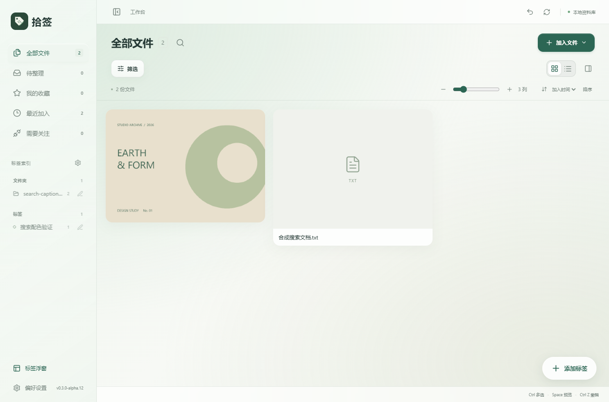
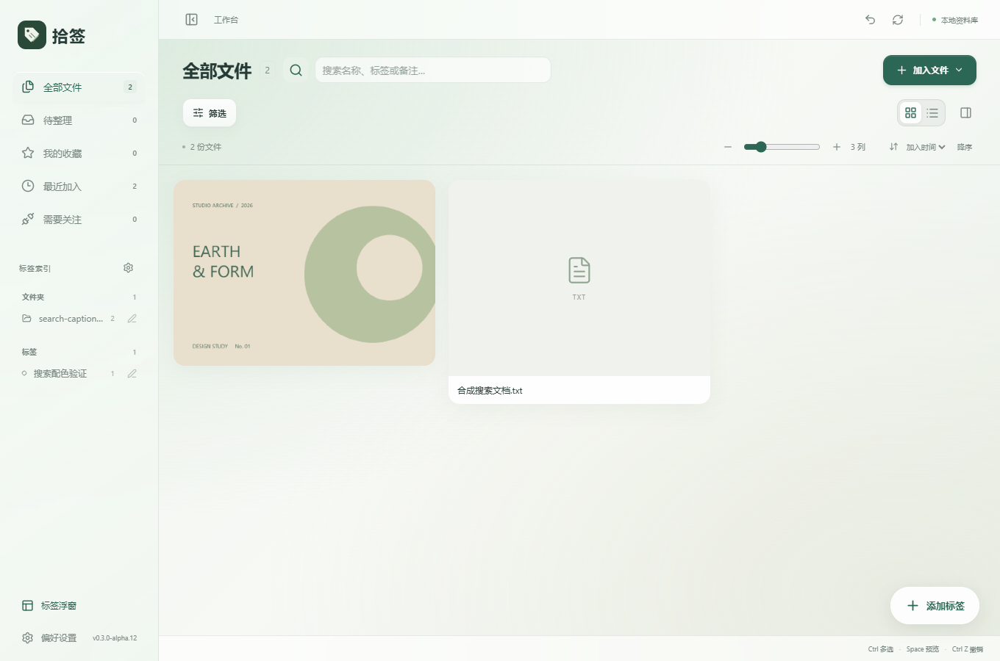
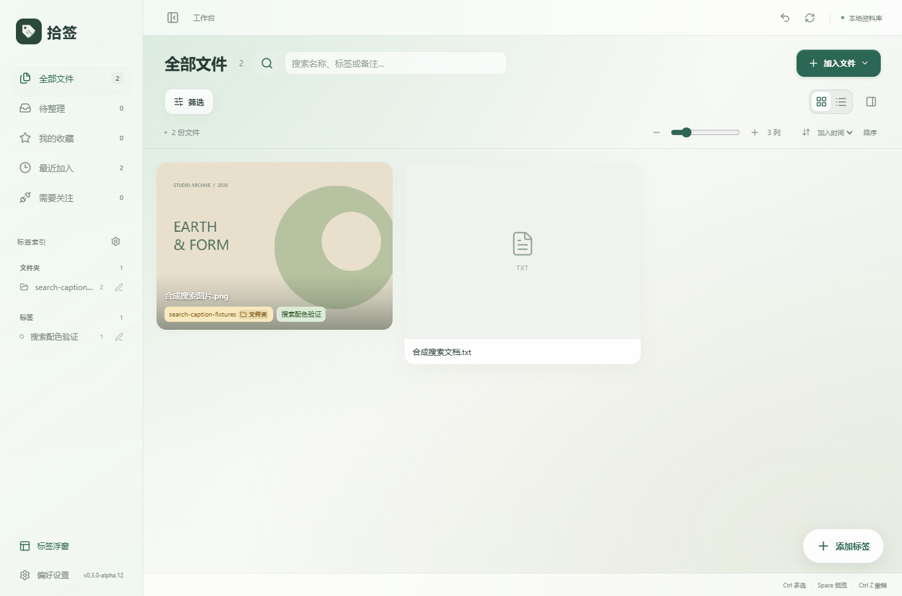
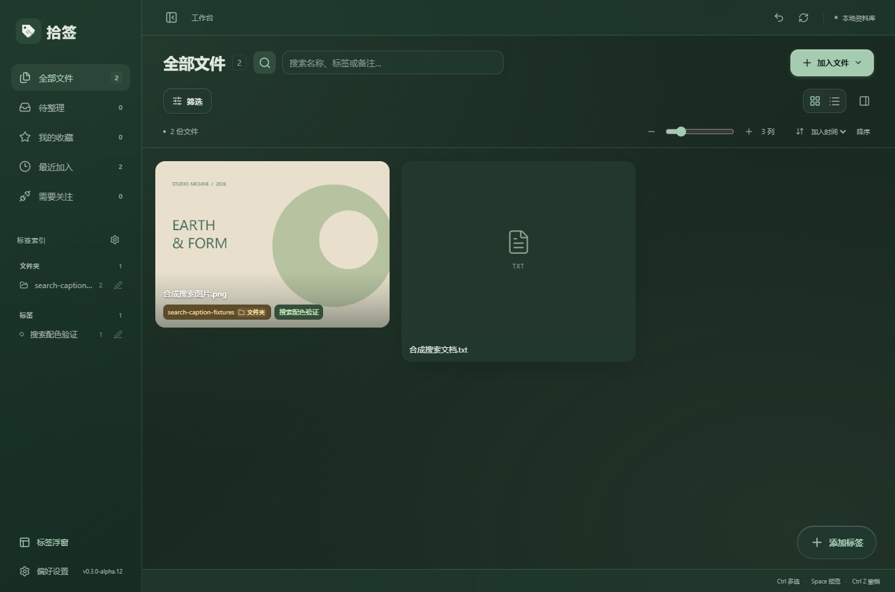

# 拾签 v0.3.0-alpha.12：轻量悬停遮罩与标题搜索

更新日期：2026-10-09

## 悬停信息减淡

图片、PDF 和普通文件预览上的文件名及全部标签继续显示在预览内部。将原先很深的渐变遮罩改成更透明的渐变，最深处不透明度从约 91% 降至 40%，渐变中段约 14%。文件名加轻微文字阴影，标签保持各自配色，减少对预览内容的遮挡。

长标签换行、多标签内部滚动和瀑布流尺寸规则保持一致。

## 标题旁的搜索入口

默认在「全部文件」及其他页面标题右侧仅显示放大镜图标，原工具栏不再占用常驻搜索框的位置。

- 点击放大镜，在标题右侧横向展开搜索栏，同时淡入并自动聚焦。
- 再次点击图标或在输入框按 Escape 收起。关键词及当前搜索结果保留，有关键词时图标保持主题色高亮。
- Ctrl+F 展开搜索栏并选中已有关键词。
- 点击输入框中的清空按钮清空关键词，保持输入焦点。
- 搜索名称、标签、备注以及中文输入法组合行为保留。
- 窄窗口中搜索框自动缩小，避免与加入文件按钮重叠。
- 系统选择减少动态效果时，关闭展开动画。

## 使用新版

交付文件位于 `D:\AI\Shiqian\releases\v0.3.0-alpha.12\`：Windows x64 安装包、单文件 EXE、源码 ZIP、说明和 SHA256 校验文件。

先关闭旧版标签浮窗，再退出旧版工作台，然后安装或启动新版。已有资料库无需重新导入。

## 验证

使用独立 QA 资料库与合成文件验证，没有操作个人资料库。

- 搜索与遮罩专项 6 组通过：默认图标入口、展开动画中间帧与焦点、关键词及中文输入法、Escape/Ctrl+F/清空、筛选及视图切换、浅深主题遮罩、960×640 窄窗口和减少动态效果设置。
- 展开搜索前后文件区域尺寸不变。
- 完整标签与浮窗回归 7 组通过。
- 瀑布流 35 个布局场景通过。
- TypeScript、Vite、Windows EXE 和 NSIS 安装包构建通过。

记录见 `docs/evidence/search-caption-*.log`。本次未验证全新 Windows 安装或多屏混合 DPI。

## 界面预览

