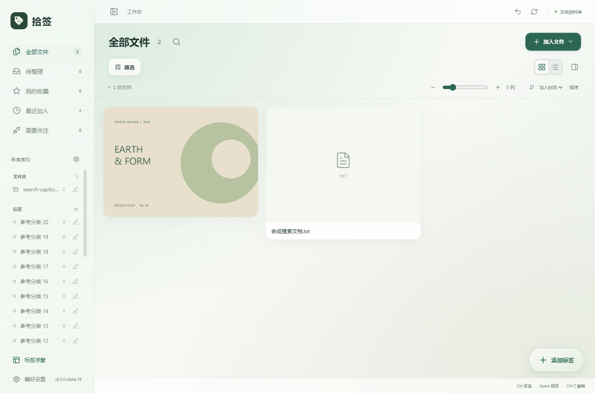
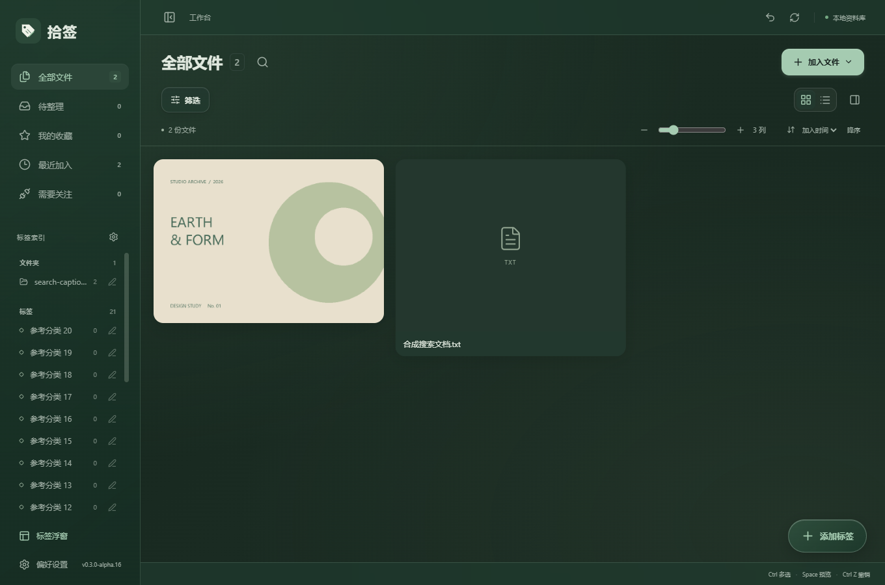
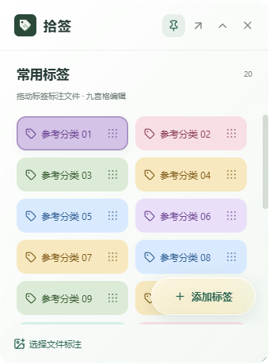
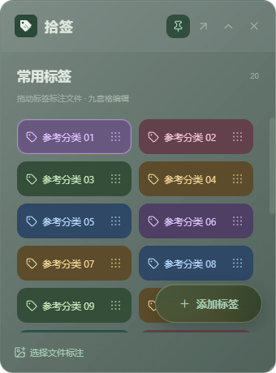

# 拾签 v0.3.0-alpha.16：侧栏过渡与玻璃按钮

更新日期：2026-10-09

## 本次变化

左侧菜单收起、展开时，导航图标和底部按钮图标保持固定尺寸及上下位置，随侧栏宽度连续移动。文字保持挂载，配合约 160 毫秒淡出与 260 毫秒位移，避免切换对齐方式、移除文字后产生跳动。品牌图标也保持原有尺寸。

标签索引保持挂载，收起时淡出并停止交互；展开后恢复原来的滚动位置。点击收起状态的标签索引图标仍能展开菜单。快速反复切换时，过渡从当前位置转向最终状态。拖动调整宽度、缩小自动收起、宽度记忆和键盘调整继续保留。系统选择减少动态效果时直接切换。

工作台和标签浮窗的“添加标签”按钮共用半透明玻璃样式：绿色透色渐变、22px 背景模糊、柔和边缘高光和扩散阴影。浅色使用浅绿玻璃，深色使用深绿玻璃，保留原有绿色主题。悬停时略微提亮。

浮窗添加按钮保持 48px 高度、右下角位置和标签上方图层，滚动标签时固定在“选择文件标注”栏上方。

## 验证

使用独立 QA 资料库和合成图片、文档，没有操作个人资料库。

- 界面专项 7 组通过：逐帧检查侧栏中间宽度、文字透明度、图标尺寸与上下位置；检查 DOM 保留、标签索引滚动记忆、收起时不可交互、快速反向切换。
- 浅深主题均确认两个按钮使用一致的半透明渐变、边框和模糊；点击可以正常打开添加标签对话框。
- 确认浮窗按钮高度仍为 48px，滚动时不移动、不阻挡滚轮，并位于底部操作栏上方。
- 侧栏既有 5 组回归通过：拖动、宽度保存、自动收起、从收起拖开、最大宽度、Escape 取消、键盘调整、减少动态效果和窄窗口布局。
- 搜索与图片遮罩既有 6 组回归通过。
- TypeScript、Vite、Windows EXE 与 NSIS 安装包构建通过。

记录见 `docs/evidence/sidebar-glass-*.log`。本次没有验证全新 Windows 安装或多屏混合 DPI。

## 使用新版

交付文件位于 `D:\AI\Shiqian\releases\v0.3.0-alpha.16\`，包括 Windows x64 安装包、单文件 EXE、源码 ZIP、本文及 SHA256 校验文件。

先关闭旧版标签浮窗，再退出旧版工作台，安装或启动新版。已有资料库无需重新导入。单文件 EXE 仍使用系统 WebView2 与本机用户资料库，并不把资料库存放在程序旁边。

## 界面预览

