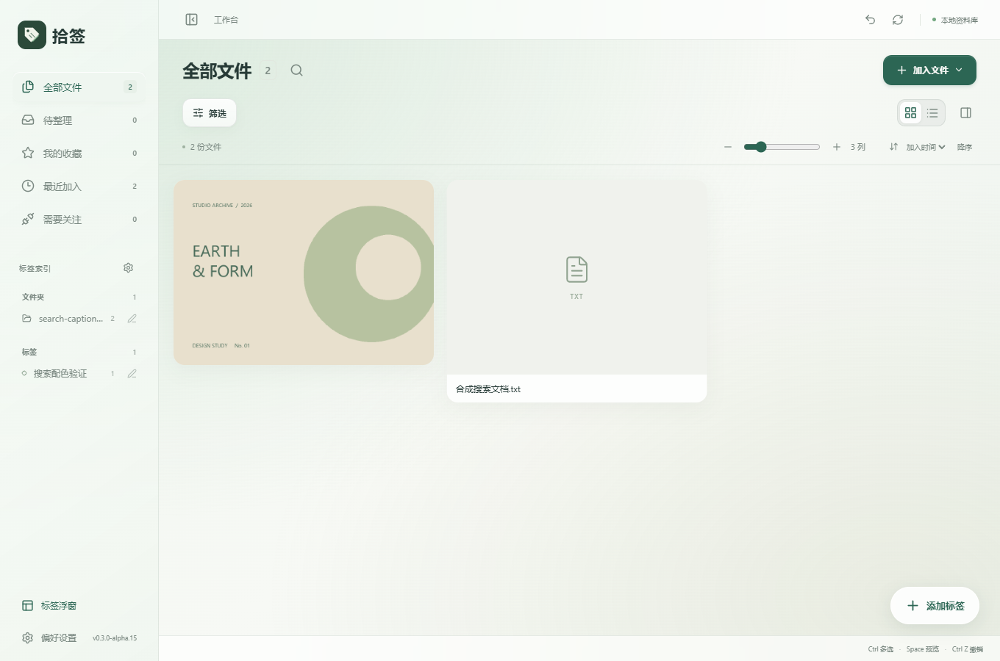
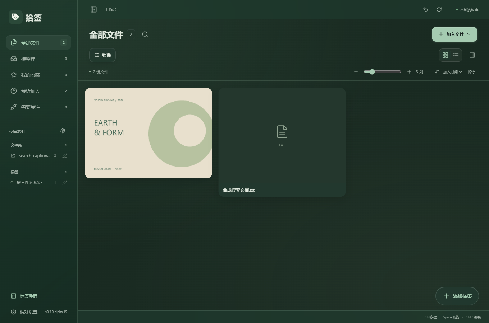

# 拾签 v0.3.0-alpha.15：文件数量与布局按钮动效

更新日期：2026-10-09

## 本次变化

页面标题旁的文件数量从 12px 放大到 14px，字重调至 500，数字采用等宽形式，让数量更清楚，同时保持标题与工具栏的原有高度。

瀑布流与列表按钮共用一块滑动高亮底板，切换时约 220 毫秒移到对应图标下方。图标配合轻微缩放，并保留按压反馈。快速切换时，高亮从当前位置转向最终选中的按钮。高亮底板不拦截点击和键盘操作。

浅色、深色模式使用现有玻璃底色和绿色主题。系统选择减少动态效果时，高亮直接切换，不播放滑动过渡。

上一版文件内容的平移动效、独立滚动位置、右侧详情展开、筛选过渡和标题搜索继续保留。

## 验证

使用独立 QA 资料库与合成文件检查，没有操作个人资料库。

- 确认数量徽标实际字号为 14px。
- 浅深主题下均观察到高亮滑动中间帧，并正确落到选中的按钮。
- 高亮不拦截点击；键盘 Enter 切换正常。
- 快速连续切换最终状态正确；减少动态效果时直接切换高亮。
- 既有搜索与遮罩 6 组回归通过，包括标题搜索及窄窗口布局。
- TypeScript、Vite、Windows EXE 和 NSIS 安装包构建通过。

记录见 `docs/evidence/view-buttons-*.log`。本次未验证全新 Windows 安装或多屏混合 DPI。

## 使用新版

交付文件位于 `D:\AI\Shiqian\releases\v0.3.0-alpha.15\`：Windows x64 安装包、单文件 EXE、源码 ZIP、说明和 SHA256 校验文件。

先关闭旧版标签浮窗，再退出旧版工作台，然后安装或启动新版。已有资料库无需重新导入。

## 界面预览

